# 💰 Diagrama de Flujo - Módulo Facturación Empresarial v2.0

> **Sistema empresarial de gestión financiera avanzada con integración multimodular**

## 🎯 **Responsabilidades del Módulo Empresarial**
- **Gestión financiera integral** con múltiples tipos de facturación
- **Integración avanzada** con módulos de logística, operaciones, reparación y SCRAP
- **Sistema de aprobaciones multinivel** con roles diferenciados
- **Cálculos automáticos** de costos por servicios especializados
- **Trazabilidad financiera completa** con auditoria automática
- **Alertas inteligentes** para SLA y cumplimiento fiscal

## 📊 **Flujo Detallado - Facturación Empresarial v2.0**

```mermaid
flowchart TD
    %% AUTENTICACIÓN Y ACCESO EMPRESARIAL
    START([🔔 Notificación Multicanal:<br/>Productos Facturables]) --> LOGIN{🔐 Autenticación<br/>Especialista Financiero}
    LOGIN -->|❌ No autorizado| AUTH_ERROR[❌ Error de Autenticación<br/>Sistema de Seguridad]
    LOGIN -->|✅ Autorizado| VERIFY_ROLE[🎯 Verificar Rol<br/>Permisos Financieros]
    
    AUTH_ERROR --> END_ERROR([❌ ACCESO DENEGADO<br/>Contactar Administrador])
    
    %% RECEPCIÓN AVANZADA DE NOTIFICACIONES
    VERIFY_ROLE --> NOTIF_ANALYSIS[🔍 Análisis de Notificación<br/>+ Prioridad + SLA]
    NOTIF_ANALYSIS --> SOURCE_CHECK{🎯 Origen de<br/>Notificación}
    
    SOURCE_CHECK -->|📦 Logística| LOGISTICS_REQUEST[📦 Solicitud de Logística<br/>Productos Despachados]
    SOURCE_CHECK -->|⚙️ Operaciones| OPERATIONS_REQUEST[⚙️ Solicitud de Operaciones<br/>Servicios Prestados]
    SOURCE_CHECK -->|🔧 Reparación| REPAIR_REQUEST[🔧 Solicitud de Reparación<br/>Servicios Técnicos]
    SOURCE_CHECK -->|♻️ SCRAP| SCRAP_REQUEST[♻️ Solicitud de SCRAP<br/>Valor Recuperado]
    
    %% PROCESAMIENTO POR TIPO DE SOLICITUD
    LOGISTICS_REQUEST --> GET_MOVEMENT_ADV[📋 Obtener Movimiento<br/>+ Trazabilidad Completa]
    OPERATIONS_REQUEST --> GET_OPERATIONS_ADV[📋 Obtener Operaciones<br/>+ Tiempos + Costos]
    REPAIR_REQUEST --> GET_REPAIR_ADV[📋 Obtener Reparaciones<br/>+ Técnicos + Materiales]
    SCRAP_REQUEST --> GET_SCRAP_ADV[📋 Obtener SCRAP<br/>+ Evaluación + Valor]
    
    %% ANÁLISIS AVANZADO DE PRODUCTOS/SERVICIOS
    GET_MOVEMENT_ADV --> PRODUCT_ANALYSIS[🔍 Análisis de Productos<br/>+ Condición + Valor]
    GET_OPERATIONS_ADV --> SERVICE_ANALYSIS[🔍 Análisis de Servicios<br/>+ Complejidad + Tiempo]
    GET_REPAIR_ADV --> REPAIR_ANALYSIS[🔍 Análisis de Reparaciones<br/>+ Materiales + Mano de Obra]
    GET_SCRAP_ADV --> SCRAP_ANALYSIS[🔍 Análisis de SCRAP<br/>+ Valor de Recuperación]
    
    %% VALIDACIÓN EMPRESARIAL DE ENTIDADES
    PRODUCT_ANALYSIS --> ENTITY_VALIDATION[🏢 Validación de Entidad<br/>Sistema Empresarial]
    SERVICE_ANALYSIS --> ENTITY_VALIDATION
    REPAIR_ANALYSIS --> ENTITY_VALIDATION
    SCRAP_ANALYSIS --> ENTITY_VALIDATION
    
    ENTITY_VALIDATION --> ENTITY_CHECK{🎯 Validación<br/>Avanzada Entidad}
    ENTITY_CHECK -->|❌ No facturable| ENTITY_NOT_BILLABLE[⚪ Entidad No Facturable<br/>+ Razón + Documentación]
    ENTITY_CHECK -->|⚠️ Requiere aprobación| ENTITY_APPROVAL_REQ[⚠️ Requiere Aprobación<br/>Supervisor Financiero]
    ENTITY_CHECK -->|✅ Facturable| ENTITY_BILLABLE[✅ Entidad Facturable<br/>Proceder Automático]
    
    %% MANEJO DE ENTIDADES NO FACTURABLES
    ENTITY_NOT_BILLABLE --> AUTO_REJECTION[❌ Rechazo Automático<br/>+ Notificación + Log]
    AUTO_REJECTION --> NOTIFY_AUTO_REJECTION[🔔 Notificar Rechazo<br/>Multicanal + Razón]
    
    %% PROCESO DE APROBACIÓN SUPERVISORA
    ENTITY_APPROVAL_REQ --> SUPERVISOR_REVIEW[👤 Revisión Supervisor<br/>Financiero Senior]
    SUPERVISOR_REVIEW --> SUPERVISOR_DECISION{🤔 Decisión<br/>Supervisor}
    SUPERVISOR_DECISION -->|❌ Rechazar| SUPERVISOR_REJECTION[❌ Rechazo Supervisora<br/>+ Justificación]
    SUPERVISOR_DECISION -->|✅ Aprobar| SUPERVISOR_APPROVAL[✅ Aprobación Supervisora<br/>+ Observaciones]
    
    SUPERVISOR_REJECTION --> RECORD_SUPERVISOR_REJECTION[📝 Registrar Rechazo<br/>+ Supervisor + Fecha]
    SUPERVISOR_APPROVAL --> ENTITY_BILLABLE
    
    %% REVISIÓN TÉCNICA ESPECIALIZADA
    ENTITY_BILLABLE --> TECHNICAL_REVIEW[🔬 Revisión Técnica<br/>Especialista Financiero]
    TECHNICAL_REVIEW --> VALIDATE_ITEMS[✅ Validar Items<br/>+ Estados + Cantidades]
    
    VALIDATE_ITEMS --> ITEM_VALIDATION{🎯 Validación<br/>de Items}
    ITEM_VALIDATION -->|❌ Items inválidos| INVALID_ITEMS[❌ Items Inválidos<br/>+ Detalles + Razones]
    ITEM_VALIDATION -->|⚠️ Items con observaciones| ITEMS_WITH_OBS[⚠️ Items con Observaciones<br/>+ Documentar + Revisar]
    ITEM_VALIDATION -->|✅ Items válidos| VALID_ITEMS[✅ Items Válidos<br/>Continuar Proceso]
    
    %% MANEJO DE ITEMS INVÁLIDOS/CON OBSERVACIONES
    INVALID_ITEMS --> RECORD_INVALID_ITEMS[📝 Registrar Items Inválidos<br/>+ Razón + Responsable]
    ITEMS_WITH_OBS --> DOCUMENT_OBSERVATIONS[📝 Documentar Observaciones<br/>+ Impacto en Precio]
    
    RECORD_INVALID_ITEMS --> NOTIFY_ITEM_REJECTION[🔔 Notificar Rechazo<br/>+ Items Específicos]
    DOCUMENT_OBSERVATIONS --> OBSERVATION_DECISION{🤔 Decisión sobre<br/>Observaciones}
    
    OBSERVATION_DECISION -->|✅ Aceptar con ajuste| ADJUST_PRICING[💰 Ajustar Precios<br/>por Observaciones]
    OBSERVATION_DECISION -->|❌ Rechazar| RECORD_INVALID_ITEMS
    
    ADJUST_PRICING --> VALID_ITEMS
    
    %% PROCESO DE APROBACIÓN FINANCIERA
    VALID_ITEMS --> FINANCIAL_APPROVAL{🎯 Decisión<br/>Financiera}
    FINANCIAL_APPROVAL -->|❌ Rechazar| MANUAL_REJECTION[❌ Rechazo Manual<br/>+ Observaciones Detalladas]
    FINANCIAL_APPROVAL -->|✅ Aprobar| APPROVE_BILLING_ADV[✅ Aprobar Facturación<br/>Sistema Avanzado]
    
    %% MANEJO DE RECHAZO MANUAL
    MANUAL_REJECTION --> INPUT_REJECTION_DETAILS[📝 Ingresar Detalles<br/>+ Razón + Recomendaciones]
    INPUT_REJECTION_DETAILS --> RECORD_MANUAL_REJECTION[📊 Registrar Rechazo<br/>+ Analista + Fecha]
    RECORD_MANUAL_REJECTION --> NOTIFY_MANUAL_REJECTION[🔔 Notificar Rechazo<br/>+ Detalles + Follow-up]
    
    %% CREACIÓN AVANZADA DE FACTURACIÓN
    APPROVE_BILLING_ADV --> CREATE_BILLING_ADV[📄 Crear Facturación<br/>Sistema Empresarial]
    CREATE_BILLING_ADV --> BILLING_TYPE_CONFIG{🎯 Configurar<br/>Tipo de Facturación}
    
    BILLING_TYPE_CONFIG -->|📦 Productos| PRODUCT_BILLING[📦 Facturación de Productos<br/>+ Cantidad + Precio Unitario]
    BILLING_TYPE_CONFIG -->|⚙️ Servicios| SERVICE_BILLING[⚙️ Facturación de Servicios<br/>+ Horas + Tarifa]
    BILLING_TYPE_CONFIG -->|🔧 Reparaciones| REPAIR_BILLING[🔧 Facturación de Reparaciones<br/>+ Materiales + Mano de Obra]
    BILLING_TYPE_CONFIG -->|♻️ SCRAP| SCRAP_BILLING[♻️ Facturación de SCRAP<br/>+ Valor Recuperado]
    
    %% CÁLCULOS ESPECIALIZADOS POR TIPO
    PRODUCT_BILLING --> CALCULATE_PRODUCT_AMOUNT[💰 Calcular Monto Productos<br/>Precio × Cantidad × Factor]
    SERVICE_BILLING --> CALCULATE_SERVICE_AMOUNT[💰 Calcular Monto Servicios<br/>Horas × Tarifa × Complejidad]
    REPAIR_BILLING --> CALCULATE_REPAIR_AMOUNT[💰 Calcular Monto Reparación<br/>Materiales + M.O. + Overhead]
    SCRAP_BILLING --> CALCULATE_SCRAP_AMOUNT[💰 Calcalar Monto SCRAP<br/>Valor Recuperado - Costos]
    
    %% CONSOLIDACIÓN DE MONTOS
    CALCULATE_PRODUCT_AMOUNT --> AMOUNT_CONSOLIDATION[💰 Consolidación de Montos<br/>+ Impuestos + Descuentos]
    CALCULATE_SERVICE_AMOUNT --> AMOUNT_CONSOLIDATION
    CALCULATE_REPAIR_AMOUNT --> AMOUNT_CONSOLIDATION
    CALCULATE_SCRAP_AMOUNT --> AMOUNT_CONSOLIDATION
    
    %% CONFIGURACIÓN AVANZADA DE MONTOS
    AMOUNT_CONSOLIDATION --> AMOUNT_CONFIG{🎯 Configuración<br/>de Montos}
    AMOUNT_CONFIG -->|🤖 Automático| AUTO_AMOUNT_ADV[🤖 Cálculo Automático<br/>+ IA + Reglas]
    AMOUNT_CONFIG -->|👤 Manual| MANUAL_AMOUNT_ADV[👤 Ingreso Manual<br/>+ Justificación]
    AMOUNT_CONFIG -->|🔄 Mixto| MIXED_AMOUNT[🔄 Cálculo Mixto<br/>Base Auto + Ajustes]
    
    %% PROCESAMIENTO DE MONTOS
    AUTO_AMOUNT_ADV --> SET_FINAL_AMOUNT[💰 Establecer Monto Final<br/>+ Desglose + Validación]
    MANUAL_AMOUNT_ADV --> MANUAL_VALIDATION[✅ Validar Monto Manual<br/>+ Límites + Aprobación]
    MIXED_AMOUNT --> MIXED_CALCULATION[🔄 Cálculo Mixto<br/>+ Validación + Ajustes]
    
    MANUAL_VALIDATION --> MANUAL_APPROVAL_CHECK{🎯 ¿Requiere<br/>Aprobación Superior?}
    MANUAL_APPROVAL_CHECK -->|✅ Sí| SENIOR_APPROVAL[👤 Aprobación Senior<br/>Montos Excepcionales]
    MANUAL_APPROVAL_CHECK -->|❌ No| SET_FINAL_AMOUNT
    MIXED_CALCULATION --> SET_FINAL_AMOUNT
    
    SENIOR_APPROVAL --> SENIOR_DECISION{🤔 Decisión<br/>Senior}
    SENIOR_DECISION -->|❌ Rechazar| SENIOR_REJECTION[❌ Rechazo Senior<br/>+ Ajustar Monto]
    SENIOR_DECISION -->|✅ Aprobar| SENIOR_APPROVED[✅ Aprobación Senior<br/>+ Autorización]
    
    SENIOR_REJECTION --> MANUAL_AMOUNT_ADV
    SENIOR_APPROVED --> SET_FINAL_AMOUNT
    
    %% GENERACIÓN AVANZADA DE DOCUMENTOS
    SET_FINAL_AMOUNT --> GENERATE_DOCUMENTS[📄 Generar Documentos<br/>+ Número + Referencias]
    GENERATE_DOCUMENTS --> DOCUMENT_VALIDATION[✅ Validar Documentos<br/>+ Secuencial + Formato]
    DOCUMENT_VALIDATION --> UPDATE_BILLING_STATUS[🔄 Actualizar Estado<br/>Facturación: Aprobada]
    
    %% NOTIFICACIÓN Y SEGUIMIENTO
    UPDATE_BILLING_STATUS --> BILLING_APPROVED_ADV[✅ Facturación Aprobada<br/>Sistema Empresarial]
    BILLING_APPROVED_ADV --> NOTIFY_STAKEHOLDERS[🔔 Notificar Stakeholders<br/>Multicanal + Documentos]
    
    NOTIFY_STAKEHOLDERS --> START_PROCESSING[⚙️ Iniciar Procesamiento<br/>+ SLA + Alertas]
    START_PROCESSING --> PROCESSING_MONITOR[📊 Monitorear Procesamiento<br/>+ KPIs + Tiempo Real]
    
    %% GESTIÓN AVANZADA DE ESTADOS
    PROCESSING_MONITOR --> PROCESSING_STATUS{📊 Estado de<br/>Procesamiento}
    PROCESSING_STATUS -->|⏳ En proceso| CONTINUE_PROCESSING[⚙️ Continuar Procesamiento<br/>+ Alertas SLA]
    PROCESSING_STATUS -->|⚠️ Con observaciones| PROCESSING_ISSUES[⚠️ Problemas en Procesamiento<br/>+ Escalamiento]
    PROCESSING_STATUS -->|✅ Completado| READY_TO_CLOSE_ADV[✅ Listo para Cerrar<br/>Validación Final]
    
    CONTINUE_PROCESSING --> SLA_CHECK[⏰ Verificar SLA<br/>+ Alertas + Escalamiento]
    SLA_CHECK --> SLA_STATUS{⏰ Estado SLA}
    SLA_STATUS -->|✅ Dentro de tiempo| PROCESSING_MONITOR
    SLA_STATUS -->|⚠️ Por vencer| SLA_WARNING[⚠️ Alerta SLA<br/>+ Notificación + Prioridad]
    SLA_STATUS -->|❌ Vencido| SLA_BREACH[❌ SLA Vencido<br/>+ Escalamiento + Reporte]
    
    SLA_WARNING --> PROCESSING_MONITOR
    SLA_BREACH --> ESCALATE_ISSUE[📢 Escalar Problema<br/>+ Manager + Urgente]
    
    PROCESSING_ISSUES --> ISSUE_ANALYSIS[🔍 Análisis de Problemas<br/>+ Causa + Solución]
    ISSUE_ANALYSIS --> ISSUE_RESOLUTION[🔧 Resolución de Problemas<br/>+ Acción + Responsable]
    ISSUE_RESOLUTION --> PROCESSING_MONITOR
    
    %% CIERRE AVANZADO DE FACTURACIÓN
    READY_TO_CLOSE_ADV --> FINAL_VALIDATION[✅ Validación Final<br/>+ Completitud + Exactitud]
    FINAL_VALIDATION --> CLOSE_DECISION_ADV{🎯 Decisión de<br/>Cierre}
    CLOSE_DECISION_ADV -->|❌ No cerrar| KEEP_OPEN_ADV[⏳ Mantener Abierta<br/>+ Razón + Seguimiento]
    CLOSE_DECISION_ADV -->|✅ Cerrar| CLOSE_BILLING_ADV[🔒 Cerrar Facturación<br/>Estado: Cerrada]
    
    %% GESTIÓN DE MODIFICACIONES
    KEEP_OPEN_ADV --> MODIFICATION_OPTION{🔧 ¿Requiere<br/>Modificaciones?}
    MODIFICATION_OPTION -->|✅ Sí| MODIFY_BILLING_ADV[✏️ Modificar Facturación<br/>+ Auditoría + Razón]
    MODIFICATION_OPTION -->|❌ No| WAIT_CONDITIONS[⏳ Esperar Condiciones<br/>para Cierre]
    
    MODIFY_BILLING_ADV --> MODIFICATION_APPROVAL[👤 Aprobación Modificación<br/>+ Supervisor + Justificación]
    MODIFICATION_APPROVAL --> MODIFICATION_DECISION{🤔 ¿Aprobar<br/>Modificación?}
    MODIFICATION_DECISION -->|❌ Rechazar| MODIFICATION_REJECTED[❌ Modificación Rechazada<br/>+ Razón + Alternativas]
    MODIFICATION_DECISION -->|✅ Aprobar| UPDATE_DETAILS_ADV[🔄 Actualizar Detalles<br/>+ Nuevos Valores + Log]
    
    MODIFICATION_REJECTED --> KEEP_OPEN_ADV
    UPDATE_DETAILS_ADV --> RECORD_MODIFICATION_ADV[📊 Registrar Modificación<br/>+ Auditoría Completa]
    RECORD_MODIFICATION_ADV --> PROCESSING_MONITOR
    
    WAIT_CONDITIONS --> CONDITION_MONITOR[📊 Monitorear Condiciones<br/>+ Auto-check + Alertas]
    CONDITION_MONITOR --> CONDITIONS_MET{✅ ¿Condiciones<br/>Cumplidas?}
    CONDITIONS_MET -->|❌ No| WAIT_CONDITIONS
    CONDITIONS_MET -->|✅ Sí| READY_TO_CLOSE_ADV
    
    %% FINALIZACIÓN EMPRESARIAL
    CLOSE_BILLING_ADV --> SET_CLOSE_DATE_ADV[📅 Establecer Fecha Cierre<br/>+ Timestamp + Responsable]
    SET_CLOSE_DATE_ADV --> FINALIZE_AMOUNT[💰 Finalizar Monto<br/>+ Desglose + Impuestos]
    FINALIZE_AMOUNT --> CREATE_FINANCIAL_HISTORY[📊 Crear Historial Financiero<br/>+ Trazabilidad Completa]
    
    CREATE_FINANCIAL_HISTORY --> UPDATE_RELATED_MODULES[🔄 Actualizar Módulos<br/>+ Estados + Referencias]
    UPDATE_RELATED_MODULES --> GENERATE_REPORTS[📈 Generar Reportes<br/>+ KPIs + Analytics]
    
    GENERATE_REPORTS --> FINAL_NOTIFICATIONS[🔔 Notificaciones Finales<br/>+ Stakeholders + Documentos]
    FINAL_NOTIFICATIONS --> ARCHIVE_DOCUMENTS[📁 Archivar Documentos<br/>+ Backup + Compliance]
    
    ARCHIVE_DOCUMENTS --> END_SUCCESS([✅ FACTURACIÓN COMPLETADA<br/>Sistema Empresarial])
    
    %% GESTIÓN DE FINALES
    NOTIFY_AUTO_REJECTION --> END_REJECTED([❌ FACTURACIÓN RECHAZADA<br/>Entidad No Facturable])
    RECORD_SUPERVISOR_REJECTION --> END_REJECTED
    NOTIFY_ITEM_REJECTION --> END_REJECTED
    NOTIFY_MANUAL_REJECTION --> END_REJECTED
    ESCALATE_ISSUE --> END_ESCALATED([📢 PROBLEMA ESCALADO<br/>Seguimiento Requerido])
    
    %% ESTILOS EMPRESARIALES
    classDef startEnd fill:#e1f5fe,stroke:#01579b,stroke-width:3px,color:#000
    classDef process fill:#f3e5f5,stroke:#4a148c,stroke-width:2px,color:#000
    classDef decision fill:#fff3e0,stroke:#e65100,stroke-width:2px,color:#000
    classDef notification fill:#f9fbe7,stroke:#33691e,stroke-width:2px,color:#000
    classDef success fill:#e8f5e8,stroke:#2e7d32,stroke-width:3px,color:#000
    classDef warning fill:#fff8e1,stroke:#f57f17,stroke-width:2px,color:#000
    classDef error fill:#ffebee,stroke:#c62828,stroke-width:2px,color:#000
    classDef financial fill:#e8f5e8,stroke:#2e7d32,stroke-width:2px,color:#000
    classDef approval fill:#e3f2fd,stroke:#1565c0,stroke-width:2px,color:#000
    classDef calculation fill:#fff3e0,stroke:#ef6c00,stroke-width:2px,color:#000
    classDef monitoring fill:#f3e5f5,stroke:#7b1fa2,stroke-width:2px,color:#000
    
    class START,END_SUCCESS,END_REJECTED,END_ESCALATED,AUTH_ERROR startEnd
    class ENTITY_CHECK,SOURCE_CHECK,SUPERVISOR_DECISION,ITEM_VALIDATION,FINANCIAL_APPROVAL decision
    class BILLING_APPROVED_ADV,READY_TO_CLOSE_ADV,ENTITY_BILLABLE,VALID_ITEMS success
    class ENTITY_APPROVAL_REQ,ITEMS_WITH_OBS,SLA_WARNING,PROCESSING_ISSUES warning
    class ENTITY_NOT_BILLABLE,INVALID_ITEMS,MANUAL_REJECTION,SLA_BREACH error
    class PRODUCT_BILLING,SERVICE_BILLING,REPAIR_BILLING,SCRAP_BILLING financial
    class SUPERVISOR_REVIEW,SENIOR_APPROVAL,MODIFICATION_APPROVAL approval
    class CALCULATE_PRODUCT_AMOUNT,CALCULATE_SERVICE_AMOUNT,CALCULATE_REPAIR_AMOUNT,CALCULATE_SCRAP_AMOUNT calculation
    class PROCESSING_MONITOR,SLA_CHECK,CONDITION_MONITOR monitoring
```



## 🏢 **Características Empresariales del Módulo Facturación v2.0**

### **💰 4 Tipos de Facturación Especializada**

#### **📦 Facturación de Productos**
- **Cálculo automático** por cantidad × precio unitario × factor de ajuste
- **Descuentos por volumen** configurables por cliente
- **Impuestos automáticos** según clasificación fiscal
- **Validación de precios** contra catálogo empresarial

#### **⚙️ Facturación de Servicios**
- **Cálculo por horas** trabajadas × tarifa × factor de complejidad
- **Categorización de servicios** con tarifas diferenciadas
- **Bonificaciones por eficiencia** automáticas
- **SLA y penalizaciones** integradas

#### **🔧 Facturación de Reparaciones**
- **Costo de materiales** + mano de obra + overhead
- **Tarifas por especialidad** técnica requerida
- **Tiempo real de reparación** vs. estimado
- **Garantías extendidas** opcionales

#### **♻️ Facturación de SCRAP**
- **Valor de recuperación** menos costos de procesamiento
- **Evaluación de materiales** preciosos recuperables
- **Certificación ambiental** incluida
- **Reportes de sostenibilidad** automáticos

### **🎯 Sistema de Aprobaciones Multinivel**
- **Nivel 1**: Analista financiero (montos estándar)
- **Nivel 2**: Supervisor financiero (montos excepcionales)
- **Nivel 3**: Manager financiero (casos especiales)
- **Nivel 4**: Director financiero (montos críticos)

### **📊 Inteligencia Financiera**
- **Cálculos automáticos con IA** para pricing óptimo
- **Análisis de rentabilidad** por cliente y tipo de servicio
- **Predicción de flujo de caja** basada en facturaciones pendientes
- **Alertas de riesgo** crediticio automáticas

### **🔔 Alertas y SLA Avanzados**
- **SLA por tipo de facturación** y cliente
- **Escalamiento automático** ante incumplimientos
- **Notificaciones multicanal** (email, SMS, push, dashboard)
- **Reportes ejecutivos** automáticos

### **📈 Analytics y Reportes**
- **Dashboard en tiempo real** con KPIs financieros
- **Análisis de tendencias** de facturación por módulo
- **ROI por tipo de servicio** y cliente
- **Compliance fiscal** automático con alertas
    UPDATE_MOVEMENT --> NOTIFY_CLOSURE[🔔 Notificar Cierre<br/>a Logística]
    
    NOTIFY_CLOSURE --> BILLING_COMPLETED[✅ Facturación Completada<br/>Proceso Finalizado]
    BILLING_COMPLETED --> END_SUCCESS([✅ Flujo Facturación<br/>Exitoso])
    
## 📊 **Tablas Principales del Sistema Empresarial v2.0**

### **Escritura (INSERT/UPDATE) - Sistema Avanzado**
- `Facturacion` - Crear y gestionar facturaciones con múltiples tipos
- `Detalle_Facturacion` - Desglose detallado por items/servicios
- `Aprobacion_Facturacion` - Registro de aprobaciones multinivel
- `Historial_Facturacion` - Auditoría completa de cambios
- `Notificacion` - Comunicación multicanal avanzada
- `Metrica_Financiera` - KPIs y métricas de desempeño
- `Control_SLA` - Seguimiento de acuerdos de nivel de servicio
- `Auditoria_Financiera` - Trazabilidad completa para compliance

### **Lectura (SELECT) - Sistema Empresarial**
- `Movimiento_Almacen` - Movimientos con productos facturables
- `Orden_Trabajo` - Servicios de operaciones facturables
- `Reparacion_Producto` - Servicios de reparación facturables
- `SCRAP_Producto` - Valores de recuperación facturables
- `Entidad` - Información comercial y crediticia avanzada
- `Configuracion_Precio` - Catálogo de precios dinámico
- `SLA_Cliente` - Acuerdos de servicio por cliente
- `Limite_Credito` - Control de riesgo crediticio

## 💰 **Estados Avanzados de Facturación Empresarial**

| Estado | Descripción | Nivel Aprobación | Acciones Disponibles |
|--------|-------------|------------------|---------------------|
| `borrador` | Facturación en creación | N/A | Editar, Enviar a Revisión |
| `en_revision` | Bajo revisión técnica | Analista | Aprobar, Rechazar, Solicitar Info |
| `pendiente_aprobacion` | Esperando aprobación | Supervisor | Aprobar, Rechazar, Escalar |
| `aprobada` | Aprobada para procesamiento | Aprobada | Procesar, Modificar con Justificación |
| `en_procesamiento` | En proceso de facturación | En Curso | Monitorear, Alertas SLA |
| `completada` | Procesamiento completado | Completada | Cerrar, Auditar |
| `cerrada` | Facturación finalizada | Cerrada | Solo Consulta, Reportes |
| `rechazada` | Rechazada en cualquier nivel | Rechazada | Revisar, Crear Nueva |
| `escalada` | Problema escalado | Escalada | Resolución de Problemas |
| `cancelada` | Cancelada por cliente/error | Cancelada | Auditoría, Documentación |

## 🎯 **Tipos de Facturación Empresarial v2.0**

### **📦 Facturación de Productos**
```sql
-- Cálculo con descuentos por volumen y cliente
SELECT dp.cantidad, cp.precio_unitario, dc.descuento_porcentaje,
       (dp.cantidad * cp.precio_unitario * (1 - dc.descuento_porcentaje/100)) as subtotal
FROM Detalle_Producto dp
JOIN Configuracion_Precio cp ON dp.producto_id = cp.producto_id
JOIN Descuento_Cliente dc ON dp.cliente_id = dc.cliente_id;
```

### **⚙️ Facturación de Servicios**
```sql
-- Cálculo por horas trabajadas con factor de complejidad
SELECT ot.horas_trabajadas, ts.tarifa_base, ot.factor_complejidad,
       (ot.horas_trabajadas * ts.tarifa_base * ot.factor_complejidad) as costo_servicio
FROM Orden_Trabajo ot
JOIN Tipo_Servicio ts ON ot.tipo_servicio_id = ts.id;
```

### **🔧 Facturación de Reparaciones**
```sql
-- Cálculo completo de reparación
SELECT r.costo_materiales, r.horas_mano_obra, tr.tarifa_tecnico,
       oh.factor_overhead,
       (r.costo_materiales + (r.horas_mano_obra * tr.tarifa_tecnico) * oh.factor_overhead) as total_reparacion
FROM Reparacion_Producto r
JOIN Tecnico_Reparacion tr ON r.tecnico_id = tr.id
JOIN Overhead_Reparacion oh ON r.complejidad = oh.nivel_complejidad;
```

### **♻️ Facturación de SCRAP**
```sql
-- Cálculo de valor recuperado menos costos
SELECT s.valor_materiales_recuperados, s.costo_procesamiento,
       s.certificacion_ambiental_costo,
       (s.valor_materiales_recuperados - s.costo_procesamiento - s.certificacion_ambiental_costo) as valor_neto_scrap
FROM SCRAP_Producto s
WHERE s.estado_evaluacion = 'completada';
```

## 🔔 **Sistema de Notificaciones Empresarial**

### **Notificaciones por Email**
| Evento | Destinatarios | Template | Adjuntos |
|--------|---------------|----------|----------|
| Facturación aprobada | Cliente, Logística, Finanzas | `billing_approved.html` | PDF Factura |
| SLA por vencer | Analista, Supervisor | `sla_warning.html` | Dashboard Link |
| Escalamiento | Manager, Director | `escalation_alert.html` | Reporte Completo |
| Facturación cerrada | Stakeholders | `billing_closed.html` | PDF Final + Analytics |

### **Notificaciones por SMS**
```sql
-- Alertas críticas por SMS
INSERT INTO Notificacion (tipo, canal, destinatario, mensaje, prioridad)
VALUES ('sla_breach', 'sms', @supervisor_phone, 
        'ALERTA: SLA facturación #{numero} vencido. Acción requerida.', 'alta');
```

### **Push Notifications**
```javascript
// Notificaciones en tiempo real via WebSocket
const notificationData = {
    type: 'billing_status_change',
    billingId: facturacionId,
    newStatus: 'aprobada',
    timestamp: new Date(),
    recipient: analista.userId
};
```

## 📈 **KPIs y Métricas Empresariales**

### **Métricas de Desempeño**
- **Tiempo promedio de aprobación** por tipo de facturación
- **Tasa de rechazo** por analista y supervisor
- **Cumplimiento SLA** por cliente y tipo de servicio
- **Valor promedio** de facturación por módulo
- **Eficiencia del proceso** (tiempo total vs. tiempo objetivo)

### **Analytics Financieros**
```sql
-- Dashboard de métricas en tiempo real
SELECT 
    COUNT(*) as total_facturaciones,
    AVG(DATEDIFF(hour, fecha_creacion, fecha_aprobacion)) as tiempo_promedio_aprobacion,
    SUM(CASE WHEN estado = 'cerrada' THEN monto_total ELSE 0 END) as facturado_total,
    COUNT(CASE WHEN fecha_vencimiento_sla < GETDATE() THEN 1 END) as sla_vencidos
FROM Facturacion 
WHERE fecha_creacion >= DATEADD(day, -30, GETDATE());
```

## 🛡️ **Compliance y Auditoria**

### **Registro de Auditoría**
```sql
-- Auditoría completa de cambios
INSERT INTO Auditoria_Financiera (
    facturacion_id, usuario_id, accion, 
    valores_anteriores, valores_nuevos, 
    justificacion, timestamp
) VALUES (
    @facturacion_id, @user_id, 'modificacion_monto',
    @old_values, @new_values, @justification, GETDATE()
);
```

### **Reportes de Compliance**
- **Reporte de modificaciones** con justificaciones
- **Análisis de patrones** de aprobación/rechazo
- **Seguimiento de SLA** por cliente y tipo
- **Trazabilidad completa** de decisiones financieras

---

**⚙️ RESULTADO FINAL**: Suite completa de flujos empresariales actualizada con todas las características avanzadas del sistema de 50+ tablas, incluyendo módulos especializados de reparación y SCRAP, sistema de usuarios multinivel, y trazabilidad completa.
AND ma.estado != 'facturado'
AND e.es_facturable_por_defecto = 1
AND NOT EXISTS (
    SELECT 1 FROM Facturacion f WHERE f.movimiento_id = ma.id_movimiento
)
GROUP BY ma.numero_documento, ma.tipo_movimiento, e.nombre, ma.fecha_movimiento;
```

### **2. Estado de Facturaciones Activas**
```sql
SELECT f.numero_factura, f.estado, f.monto_total,
       f.fecha_solicitud, f.fecha_aprobacion, f.fecha_cierre,
       e.nombre as entidad, u.nombre as operador
FROM Facturacion f
JOIN Movimiento_Almacen ma ON f.movimiento_id = ma.id_movimiento
JOIN Entidad e ON ma.entidad_id = e.id_entidad
JOIN Usuario u ON f.operador_facturacion_id = u.id_usuario
WHERE f.estado IN ('pendiente', 'aprobada')
ORDER BY f.fecha_solicitud DESC;
```

### **3. Reporte Financiero por Período**
```sql
SELECT e.nombre as entidad,
       COUNT(f.id_facturacion) as total_facturaciones,
       SUM(f.monto_total) as monto_total_periodo,
       AVG(f.monto_total) as promedio_facturacion
FROM Facturacion f
JOIN Movimiento_Almacen ma ON f.movimiento_id = ma.id_movimiento
JOIN Entidad e ON ma.entidad_id = e.id_entidad
WHERE f.fecha_cierre BETWEEN @fecha_inicio AND @fecha_fin
AND f.estado = 'cerrada'
GROUP BY e.nombre
ORDER BY monto_total_periodo DESC;
```

### **4. Facturaciones Pendientes por Operador**
```sql
SELECT u.nombre as operador,
       COUNT(f.id_facturacion) as pendientes,
       AVG(DATEDIFF(day, f.fecha_solicitud, GETDATE())) as dias_promedio_pendiente
FROM Facturacion f
JOIN Usuario u ON f.operador_facturacion_id = u.id_usuario
WHERE f.estado = 'pendiente'
GROUP BY u.nombre
ORDER BY pendientes DESC;
```

## ⚡ **Métricas de Rendimiento**

- **Tiempo promedio de aprobación**: Desde solicitud hasta aprobación
- **Facturaciones por operador**: Carga de trabajo distribuida
- **Monto promedio por facturación**: Análisis financiero
- **Tasa de rechazo**: Calidad de solicitudes
- **Facturaciones cerradas por período**: Flujo de ingresos

## 🚨 **Validaciones Críticas**

### **1. Verificación de Entidad Facturable**
```sql
-- Solo procesar si la entidad es facturable
SELECT e.es_facturable_por_defecto
FROM Movimiento_Almacen ma
JOIN Entidad e ON ma.entidad_id = e.id_entidad
WHERE ma.id_movimiento = @movimiento_id
AND e.es_facturable_por_defecto = 1;
```

### **2. Control de Duplicados**
```sql
-- Evitar facturaciones duplicadas
SELECT COUNT(*) as existente
FROM Facturacion f
WHERE f.movimiento_id = @movimiento_id;
-- Debe ser 0 para proceder
```

### **3. Validación de Estados**
```sql
-- Solo permitir cierre si está aprobada
UPDATE Facturacion 
SET estado = 'cerrada', fecha_cierre = GETDATE()
WHERE id_facturacion = @facturacion_id
AND estado = 'aprobada';
```

## 📋 **Reportes Disponibles**

### **1. Dashboard Financiero**
- Facturaciones pendientes de aprobación
- Montos facturados por período
- Entidades con mayor facturación
- Tiempo promedio de procesamiento

### **2. Reporte de Auditoría**
- Historial de modificaciones
- Facturaciones rechazadas con motivos
- Análisis de patrones de rechazo
- Actividad por operador

### **3. Análisis de Rendimiento**
- Productos más facturados
- Entidades con mayor volumen
- Estacionalidad de facturación
- Proyecciones financieras

---

**🔙 Flujo anterior**: [Módulo Operaciones](./DIAGRAMA_FLUJO_OPERACIONES.md)
**📊 Vista general**: [Diagrama General](./DIAGRAMA_FLUJO_GENERAL.md)
