# 🔄 Diagrama de Flujo General - Sistema SIGA Completo v2.0

> **Flujo empresarial completo con 4 tipos de productos, reparaciones, SCRAP y trazabilidad total**

## 📊 **Flujo General Empresarial Completo**

```mermaid
flowchart TD
    %% INICIO DEL SISTEMA
    START([🚚 Llegada de Productos<br/>al Sistema SIGA]) --> LOGIN{🔐 Autenticación<br/>por Rol y Permisos}
    
    LOGIN --> INGRESO{📋 Registrar Ingreso<br/>con Trazabilidad}
    
    %% CLASIFICACIÓN AVANZADA DE PRODUCTOS
    INGRESO --> TIPO_PROD{🏷️ Clasificar por<br/>Tipo de Producto}
    
    %% 4 TIPOS DE PRODUCTOS ESPECIALIZADOS
    TIPO_PROD -->|Almacenaje/Procesamiento| ALP_FLOW[📦 Flujo Almacenaje<br/>+ Tabla Detalle_AP]
    TIPO_PROD -->|Activo Fijo| ACT_FLOW[🏭 Flujo de Activos<br/>+ Tabla Detalle_Activo]
    TIPO_PROD -->|Suministro/Insumo| SUM_FLOW[📋 Flujo Suministros<br/>+ Tabla Detalle_Suministro]
    TIPO_PROD -->|Otros Especiales| OTR_FLOW[🔧 Flujo Otros<br/>+ Tabla Detalle_Otros]
    
    %% FLUJO ALMACENAJE/PROCESAMIENTO
    ALP_FLOW --> ALP_UBI[🏢 Ubicación Jerárquica<br/>País→Estado→Ciudad→Almacén→Rack]
    ALP_UBI --> ALP_DECISION{¿Requiere<br/>Procesamiento?}
    
    ALP_DECISION -->|No| ALP_STORE[� Solo Almacenamiento<br/>Estado: Ubicado]
    ALP_DECISION -->|Sí| ALP_PROCESS[⚙️ Enviar a Operaciones<br/>Crear Orden de Trabajo]
    
    %% FLUJO DE ACTIVOS
    ACT_FLOW --> ACT_ASIGN[🏷️ Asignación Patrimonial<br/>+ Responsable + Centro Costo]
    ACT_ASIGN --> ACT_MAINT{¿Requiere<br/>Mantenimiento?}
    ACT_MAINT -->|Sí| ACT_MAINT_PROG[📅 Programar Mantenimiento<br/>Preventivo]
    ACT_MAINT -->|No| ACT_USE[✅ En Uso<br/>Estado: Operativo]
    
    %% FLUJO DE SUMINISTROS
    SUM_FLOW --> SUM_STOCK[� Control de Stock<br/>Mín/Máx/Punto Reorden]
    SUM_STOCK --> SUM_AUTH{¿Requiere<br/>Autorización?}
    SUM_AUTH -->|Sí| SUM_APPROVAL[👤 Solicitar Autorización<br/>Supervisor]
    SUM_AUTH -->|No| SUM_AVAIL[✅ Disponible<br/>Para Consumo]
    
    %% MÓDULO DE OPERACIONES AVANZADO
    ALP_PROCESS --> OP_NOTIF[🔔 Notificación Avanzada<br/>Sistema + Email + Push]
    OP_NOTIF --> OP_ORDER[� Crear Orden Trabajo<br/>Multinivel de Aprobación]
    
    OP_ORDER --> OP_APPROVAL{Proceso de<br/>Aprobación}
    OP_APPROVAL -->|❌ Rechazada| OP_REJECT[❌ Orden Rechazada<br/>+ Observaciones Detalladas]
    OP_APPROVAL -->|✅ Aprobada| OP_ASSIGN[👥 Asignar Especialistas<br/>por Proceso]
    
    %% PROCESOS CON SEGUIMIENTO DETALLADO
    OP_ASSIGN --> PROC_LOOP{🔄 Para cada<br/>Proceso Especializado}
    PROC_LOOP --> PROC_SPECIALIST[👨‍� Asignar Especialista<br/>+ Certificaciones]
    PROC_SPECIALIST --> PROC_EXEC[⚙️ Ejecutar con Seguimiento<br/>Tiempos + Costos + Fotos]
    
    PROC_EXEC --> PROC_QC[🔍 Control de Calidad<br/>Inspector Especializado]
    PROC_QC --> PROC_RESULT{Resultado del<br/>Control de Calidad}
    
    %% RESULTADOS DE PROCESOS
    PROC_RESULT -->|✅ Aprobado| PROC_OK[✅ Producto Aprobado<br/>Continuar Flujo]
    PROC_RESULT -->|⚠️ Aprobado c/Obs| PROC_OBS[⚠️ Registrar Observación<br/>Sistema Avanzado]
    PROC_RESULT -->|❌ Defectuoso| PROC_DEF[❌ Producto Defectuoso<br/>Decidir Acción]
    
    
    %% DECISIÓN PARA PRODUCTOS DEFECTUOSOS - SISTEMA COMPLETO
    PROC_DEF --> DEF_DECISION{🤔 Evaluar Producto<br/>Defectuoso}
    
    DEF_DECISION -->|🔧 Reparable| REP_MODULE[🔧 MÓDULO REPARACIÓN<br/>Orden de Servicio]
    DEF_DECISION -->|♻️ SCRAP| SCRAP_MODULE[♻️ MÓDULO SCRAP<br/>Evaluación de Valor]
    DEF_DECISION -->|🔄 Reprocesar| PROC_LOOP
    
    %% MÓDULO DE REPARACIÓN COMPLETO
    REP_MODULE --> REP_CATEG[🏷️ Categorizar Reparación<br/>Tipo + Complejidad]
    REP_CATEG --> REP_TECH[👨‍🔧 Asignar Técnico<br/>Especialista Certificado]
    REP_TECH --> REP_DIAG[🔍 Diagnóstico Detallado<br/>+ Fotos + Evaluación]
    
    REP_DIAG --> REP_DECISION{¿Es<br/>Reparable?}
    REP_DECISION -->|❌ No| REP_TO_SCRAP[♻️ Enviar a SCRAP<br/>No Recuperable]
    REP_DECISION -->|✅ Sí| REP_REPAIR[🔧 Proceso Reparación<br/>+ Repuestos + Tiempo]
    
    REP_REPAIR --> REP_TEST[🧪 Pruebas de<br/>Funcionalidad]
    REP_TEST --> REP_RESULT{Resultado<br/>Reparación}
    
    REP_RESULT -->|✅ Recuperado| REP_OK[✅ Producto Recuperado<br/>+ Garantía]
    REP_RESULT -->|⚠️ Parcial| REP_PARTIAL[⚠️ Recuperado Parcial<br/>+ Limitaciones]
    REP_RESULT -->|❌ Fallida| REP_TO_SCRAP
    
    %% MÓDULO SCRAP AVANZADO
    SCRAP_MODULE --> SCRAP_TYPE[🏷️ Clasificar SCRAP<br/>por Tipo y Normativa]
    REP_TO_SCRAP --> SCRAP_TYPE
    
    SCRAP_TYPE --> SCRAP_EVAL[💰 Evaluación de Valor<br/>Recuperable vs Original]
    SCRAP_EVAL --> SCRAP_AUTH[👤 Autorización<br/>Supervisor Especializado]
    
    SCRAP_AUTH --> SCRAP_LOCATION[📍 Ubicación SCRAP<br/>Especializada por Tipo]
    SCRAP_LOCATION --> SCRAP_DISPOSAL{Método de<br/>Disposición}
    
    SCRAP_DISPOSAL -->|💰 Venta| SCRAP_SELL[� Proceso de Venta<br/>+ Comprador]
    SCRAP_DISPOSAL -->|♻️ Reciclaje| SCRAP_RECYCLE[♻️ Envío a Reciclaje<br/>+ Certificación]
    SCRAP_DISPOSAL -->|🗑️ Destrucción| SCRAP_DESTROY[🗑️ Destrucción Controlada<br/>+ Normativas]
    
    %% DESPACHO
    PREP_DESP --> GEN_GUIA[📄 Generar Guía<br/>de Despacho]
    GEN_GUIA --> CHECK_FACT{¿Requiere<br/>Facturación?}
    
    CHECK_FACT -->|No| DESP_DIR[🚛 Despacho Directo<br/>Estado: Despachado]
    CHECK_FACT -->|Sí| NOTIF_FACT[🔔 Notificar a<br/>Facturación]
    
    %% MÓDULO FACTURACIÓN
    NOTIF_FACT --> FACT_REV[💰 Operador Facturación<br/>Revisa Solicitud]
    FACT_REV --> FACT_DEC{Decisión Facturación}
    
    FACT_DEC -->|❌ Rechaza| FACT_RECH[❌ Facturación Rechazada<br/>+ Observaciones]
    FACT_DEC -->|✅ Aprueba| FACT_APR[✅ Facturación Aprobada<br/>Asignar Fechas]
    
    FACT_APR --> FACT_DET[📋 Detalles de Facturación<br/>Montos + Fechas]
    FACT_DET --> FACT_EST{Estado Facturación}
    
    FACT_EST --> FACT_PEND[⏳ Pendiente]
    FACT_EST --> FACT_CERR[🔒 Cerrada]
    
    FACT_CERR --> DESP_FINAL[🚛 Despacho Final<br/>Estado: Despachado]
    
    %% FINALES
    ALMACEN_END --> END_SUCCESS([✅ Flujo Completado])
    ACTIVO_END --> END_SUCCESS
    DESP_DIR --> END_SUCCESS
    DESP_FINAL --> END_SUCCESS
    
    %% RECHAZOS Y ERRORES
    ORDEN_RECH --> END_REJECT([❌ Proceso Detenido])
    DEV_RECH --> END_REJECT
    FACT_RECH --> END_REJECT
    
    %% ESTILOS
    classDef logistica fill:#e1f5fe,stroke:#01579b,stroke-width:2px,color:#000000
    classDef operaciones fill:#f3e5f5,stroke:#4a148c,stroke-width:2px,color:#000000
    classDef facturacion fill:#e8f5e8,stroke:#1b5e20,stroke-width:2px,color:#000000
    classDef decision fill:#fff3e0,stroke:#e65100,stroke-width:2px,color:#000000
    classDef success fill:#e8f5e8,stroke:#2e7d32,stroke-width:3px,color:#000000
    classDef error fill:#ffebee,stroke:#c62828,stroke-width:2px,color:#000000
    classDef notification fill:#f9fbe7,stroke:#33691e,stroke-width:2px,color:#000000
    
    %% APLICAR ESTILOS
    class LOG_REG,LOG_CLASS,ALMACEN,ACTIVO,PROCES,LOG_APROB,ASIG_PROD,LOG_DEV,PREP_DESP,GEN_GUIA logistica
    class OP_SOL,OP_RECIB,PROC_CONFIG,PROC_ASIG,PROC_EXEC,VALID_FINAL,SOL_DEV operaciones
    class FACT_REV,FACT_APR,FACT_DET facturacion
    class INGRESO,LOG_CLASS,LOG_APROB,PROC_RESULT,NEXT_PROC,LOG_DEV,CHECK_FACT,FACT_DEC,FACT_EST decision
    class END_SUCCESS,ALMACEN_END,ACTIVO_END,DESP_DIR,DESP_FINAL success
    class END_REJECT,ORDEN_RECH,DEV_RECH,FACT_RECH error
    class NOTIF_OP,NOTIF_RECH,NOTIF_ASIG,NOTIF_FACT notification
```

## 🎯 **Estados Clave del Producto**

| Estado | Descripción | Módulo Responsable |
|--------|-------------|-------------------|
| `Ingresado` | Producto registrado en el sistema | Logística |
| `Ubicado` | Asignado a ubicación física | Logística |
| `En Espera` | Listo para procesamiento | Logística → Operaciones |
| `En Proceso` | Ejecutando procesos de manufactura | Operaciones |
| `Funcional OK` | Proceso completado exitosamente | Operaciones |
| `Defectuoso` | Requiere observaciones y manejo especial | Operaciones |
| `Terminado` | Listo para devolución | Operaciones → Logística |
| `Listo Despacho` | Preparado para salida | Logística |
| `Facturado` | Proceso de facturación completado | Facturación |
| `Despachado` | Producto fuera del almacén | Logística |

## 🔔 **Sistema de Notificaciones**

### Flujo de Notificaciones Automáticas:
1. **Logística → Operaciones**: Productos listos para procesamiento
2. **Operaciones → Logística**: Solicitud de productos y devolución
3. **Logística → Facturación**: Productos listos para facturar
4. **Facturación → Logística**: Aprobación/rechazo de facturación

## 📊 **Métricas de Seguimiento**

- **Tiempo en cada proceso**: `fecha_salida - fecha_ingreso`
- **Productos defectuosos por proceso**: Análisis de calidad
- **Órdenes pendientes**: Carga de trabajo por operador
- **Ubicaciones disponibles**: Capacidad de almacén
- **Facturaciones pendientes**: Estado financiero

---

**📋 Nota**: Este diagrama muestra el flujo completo. Para detalles específicos de cada módulo, consulta los diagramas individuales.
