# 📦 Diagrama de Flujo - Módulo Logística Empresarial v2.0

> **Sistema empresarial de gestión logística avanzada con 4 tipos de productos especializados**

## 🎯 **Responsabilidades del Módulo Empresarial**
- **Recepción inteligente** con clasificación automática por 4 tipos
- **Gestión de ubicaciones especializadas** por tipo de producto
- **Sistema de aprobaciones multinivel** con roles diferenciados
- **Integración avanzada** con módulos de operaciones, reparación y SCRAP
- **Trazabilidad completa** con documentación fotográfica
- **Notificaciones multicanal** (email, SMS, push)

## 📊 **Flujo Detallado - Logística Empresarial v2.0**

```mermaid
flowchart TD
    %% AUTENTICACIÓN Y ACCESO
    START([🚚 Recepción de Productos<br/>Sistema Empresarial]) --> LOGIN{🔐 Autenticación<br/>Especialista Logístico}
    LOGIN -->|❌ No autorizado| AUTH_ERROR[❌ Error de Autenticación<br/>Sistema de Seguridad]
    LOGIN -->|✅ Autorizado| VERIFY_ROLE[🎯 Verificar Rol<br/>Permisos Logísticos]
    
    AUTH_ERROR --> END_ERROR([❌ ACCESO DENEGADO<br/>Contactar Administrador])
    
    %% CREACIÓN DE MOVIMIENTO AVANZADO
    VERIFY_ROLE --> MOV_CREATE[📝 Crear Movimiento<br/>Sistema Empresarial v2.0]
    MOV_CREATE --> MOV_TYPE{🎯 Tipo de<br/>Movimiento}
    
    MOV_TYPE -->|📥 INGRESO| INGRESO_CONFIG[📥 Configurar Ingreso<br/>+ Documentación]
    MOV_TYPE -->|📤 SALIDA| SALIDA_CONFIG[📤 Configurar Salida<br/>+ Autorización]
    MOV_TYPE -->|🔄 TRANSFERENCIA| TRANSFER_CONFIG[🔄 Configurar Transferencia<br/>+ Validación]
    
    %% CONFIGURACIÓN DE INGRESO EMPRESARIAL
    INGRESO_CONFIG --> ENTIDAD_ADV{🏢 Gestión Avanzada<br/>de Entidades}
    ENTIDAD_ADV -->|🏭 Cliente| CLIENT_SELECT[� Seleccionar Cliente<br/>+ Contrato + SLA]
    ENTIDAD_ADV -->|🏪 Proveedor| SUPPLIER_SELECT[🏪 Seleccionar Proveedor<br/>+ Calificación + Términos]
    ENTIDAD_ADV -->|🏢 Interno| INTERNAL_CONFIG[� Movimiento Interno<br/>+ Centro de Costo]
    
    CLIENT_SELECT --> DOC_VALIDATION[� Validación Documental<br/>+ Fotografías + Firmas]
    SUPPLIER_SELECT --> DOC_VALIDATION
    INTERNAL_CONFIG --> DOC_VALIDATION
    
    DOC_VALIDATION --> PROD_RECEPTION[📦 Recepción de Productos<br/>Sistema Avanzado]
    
    %% RECEPCIÓN AVANZADA DE PRODUCTOS EMPRESARIALES
    PROD_RECEPTION --> PROD_LOOP{🔄 Para cada<br/>Producto Recibido}
    PROD_LOOP --> PROD_SCAN[� Escanear Producto<br/>QR/Barcode + Serie]
    
    PROD_SCAN --> PROD_PHOTO[📸 Documentación Fotográfica<br/>Estado + Condición]
    PROD_PHOTO --> PROD_INSPECT[🔍 Inspección Inicial<br/>Inspector Logístico]
    
    PROD_INSPECT --> CONDITION_CHECK{🎯 Evaluación<br/>Condición}
    CONDITION_CHECK -->|✅ Excelente| CONDITION_EXCELLENT[✅ Condición Excelente<br/>Sin Observaciones]
    CONDITION_CHECK -->|⚠️ Buena| CONDITION_GOOD[⚠️ Condición Buena<br/>Observaciones Menores]
    CONDITION_CHECK -->|🔶 Regular| CONDITION_FAIR[🔶 Condición Regular<br/>Requiere Evaluación]
    CONDITION_CHECK -->|❌ Mala| CONDITION_POOR[❌ Condición Mala<br/>Evaluación Especializada]
    
    %% CLASIFICACIÓN AVANZADA POR 4 TIPOS EMPRESARIALES
    CONDITION_EXCELLENT --> PROD_CLASSIFY{🎯 Clasificación<br/>Empresarial}
    CONDITION_GOOD --> PROD_CLASSIFY
    CONDITION_FAIR --> SPECIAL_EVAL[� Evaluación Especializada<br/>Decidir Clasificación]
    CONDITION_POOR --> SPECIAL_EVAL
    
    SPECIAL_EVAL --> SPECIALIST_DECISION{🤔 Decisión<br/>Especialista}
    SPECIALIST_DECISION -->|✅ Aceptar| PROD_CLASSIFY
    SPECIALIST_DECISION -->|❌ Rechazar| REJECTION_PROCESS[❌ Proceso de Rechazo<br/>+ Documentación]
    SPECIALIST_DECISION -->|🔧 Reparar| TO_REPAIR_IMMEDIATE[🔧 Envío Inmediato<br/>a Reparación]
    
    %% 4 TIPOS DE PRODUCTOS EMPRESARIALES
    PROD_CLASSIFY -->|📦 TIPO A| TYPE_A_PROCESS[� TIPO A - Almacenaje<br/>Productos de Alto Valor]
    PROD_CLASSIFY -->|⚙️ TIPO B| TYPE_B_PROCESS[⚙️ TIPO B - Procesamiento<br/>Manufactura Especializada]
    PROD_CLASSIFY -->|🏭 TIPO C| TYPE_C_PROCESS[🏭 TIPO C - Activos<br/>Equipos y Maquinaria]
    PROD_CLASSIFY -->|📋 TIPO D| TYPE_D_PROCESS[� TIPO D - Suministros<br/>Consumibles Críticos]
    
    %% PROCESO ESPECIALIZADO TIPO A - ALMACENAJE PREMIUM
    TYPE_A_PROCESS --> TYPE_A_STORAGE[🏢 Área Especializada<br/>Tipo A - Seguridad Alta]
    TYPE_A_STORAGE --> TYPE_A_CLIMATE[🌡️ Control Climático<br/>Temperatura + Humedad]
    TYPE_A_CLIMATE --> TYPE_A_SECURITY[� Seguridad Premium<br/>Acceso Restringido]
    TYPE_A_SECURITY --> TYPE_A_LOCATION[� Asignar Ubicación<br/>Zona Premium]
    
    %% PROCESO ESPECIALIZADO TIPO B - PROCESAMIENTO AVANZADO
    TYPE_B_PROCESS --> TYPE_B_ANALYSIS[🔬 Análisis Técnico<br/>Especificaciones]
    TYPE_B_ANALYSIS --> TYPE_B_ROUTE[🛤️ Planificar Ruta<br/>de Procesamiento]
    TYPE_B_ROUTE --> TYPE_B_QUEUE[⏳ Cola de Procesamiento<br/>Prioridad Asignada]
    TYPE_B_QUEUE --> TYPE_B_NOTIFY[🔔 Notificar Operaciones<br/>Producto Listo]
    
    %% PROCESO ESPECIALIZADO TIPO C - ACTIVOS EMPRESARIALES
    TYPE_C_PROCESS --> TYPE_C_REGISTER[📋 Registro de Activo<br/>+ Placa + Responsable]
    TYPE_C_REGISTER --> TYPE_C_DEPRECIATION[💰 Cálculo Depreciación<br/>Valor Contable]
    TYPE_C_DEPRECIATION --> TYPE_C_ASSIGNMENT[� Asignar Responsable<br/>Custodio Activo]
    TYPE_C_ASSIGNMENT --> TYPE_C_LOCATION[� Ubicación Específica<br/>Área de Activos]
    
    %% PROCESO ESPECIALIZADO TIPO D - SUMINISTROS CRÍTICOS
    TYPE_D_PROCESS --> TYPE_D_INVENTORY[📊 Control de Inventario<br/>Stock Mínimo/Máximo]
    TYPE_D_INVENTORY --> TYPE_D_EXPIRY[� Control de Vencimientos<br/>FIFO/FEFO]
    TYPE_D_EXPIRY --> TYPE_D_LOCATION[📍 Ubicación por Lote<br/>Área de Suministros]
    TYPE_D_LOCATION --> TYPE_D_ALERT[� Configurar Alertas<br/>Stock Crítico]
    
    %% ACTUALIZACIÓN DE UBICACIONES Y TRAZABILIDAD
    TYPE_A_LOCATION --> TYPE_A_UPDATE[🔄 Actualizar Estado<br/>Ubicación Premium]
    TYPE_B_NOTIFY --> TYPE_B_UPDATE[🔄 Estado: En Cola<br/>Procesamiento]
    TYPE_C_LOCATION --> TYPE_C_UPDATE[🔄 Registro Activo<br/>Sistema Contable]
    TYPE_D_ALERT --> TYPE_D_UPDATE[🔄 Actualizar Inventario<br/>Stock Disponible]
    
    %% HISTORIAL COMPLETO DE TRAZABILIDAD
    TYPE_A_UPDATE --> HIST_TYPE_A[📊 Historial Completo<br/>Tipo A - Premium]
    TYPE_B_UPDATE --> HIST_TYPE_B[📊 Historial Completo<br/>Tipo B - Procesamiento]
    TYPE_C_UPDATE --> HIST_TYPE_C[📊 Historial Completo<br/>Tipo C - Activos]
    TYPE_D_UPDATE --> HIST_TYPE_D[📊 Historial Completo<br/>Tipo D - Suministros]
    
    %% FINALIZACIÓN DE INGRESO
    HIST_TYPE_A --> FINAL_TYPE_A[✅ Tipo A Almacenado<br/>Seguridad Premium]
    HIST_TYPE_B --> FINAL_TYPE_B[✅ Tipo B En Cola<br/>Operaciones Notificadas]
    HIST_TYPE_C --> FINAL_TYPE_C[✅ Tipo C Asignado<br/>Activo Registrado]
    HIST_TYPE_D --> FINAL_TYPE_D[✅ Tipo D Inventariado<br/>Control Automático]
    
    %% VERIFICACIÓN DE MÁS PRODUCTOS
    FINAL_TYPE_A --> MORE_PRODUCTS{🔄 ¿Más Productos<br/>en el Movimiento?}
    FINAL_TYPE_B --> MORE_PRODUCTS
    FINAL_TYPE_C --> MORE_PRODUCTS
    FINAL_TYPE_D --> MORE_PRODUCTS
    REJECTION_PROCESS --> MORE_PRODUCTS
    TO_REPAIR_IMMEDIATE --> MORE_PRODUCTS
    
    MORE_PRODUCTS -->|✅ Sí| PROD_LOOP
    MORE_PRODUCTS -->|❌ No| MOV_COMPLETE[✅ Movimiento Completado<br/>Sistema Empresarial]
    
    %% GESTIÓN AVANZADA DE ÓRDENES DE TRABAJO
    MOV_COMPLETE --> ORDER_MANAGEMENT[📋 Gestión de Órdenes<br/>Sistema Avanzado]
    ORDER_MANAGEMENT --> WAIT_ORDERS[⏳ Monitor de Órdenes<br/>Tiempo Real]
    
    WAIT_ORDERS --> ORDER_RECEIVED[📨 Orden Recibida<br/>+ Prioridad + SLA]
    ORDER_RECEIVED --> ORDER_ANALYSIS[🔍 Análisis Avanzado<br/>Orden + Recursos]
    
    ORDER_ANALYSIS --> ORDER_VALIDATION{🎯 Validación<br/>Multinivel}
    ORDER_VALIDATION -->|📋 Recursos| RESOURCE_CHECK[📦 Verificar Recursos<br/>Disponibilidad]
    ORDER_VALIDATION -->|👤 Autorización| AUTH_CHECK[👤 Verificar Autorización<br/>Nivel Requerido]
    ORDER_VALIDATION -->|⏰ SLA| SLA_CHECK[⏰ Verificar SLA<br/>Tiempo Comprometido]
    
    %% PROCESO DE VALIDACIÓN AVANZADO
    RESOURCE_CHECK --> RESOURCE_RESULT{Recursos<br/>Disponibles}
    AUTH_CHECK --> AUTH_RESULT{Autorización<br/>Válida}
    SLA_CHECK --> SLA_RESULT{SLA<br/>Cumplible}
    
    RESOURCE_RESULT -->|❌ No| ORDER_REJECT_RESOURCE[❌ Rechazar por Recursos<br/>+ Alternativas]
    AUTH_RESULT -->|❌ No| ORDER_REJECT_AUTH[❌ Rechazar por Autorización<br/>+ Escalar]
    SLA_RESULT -->|❌ No| ORDER_REJECT_SLA[❌ Rechazar por SLA<br/>+ Renegociar]
    
    RESOURCE_RESULT -->|✅ Sí| VALIDATION_OK[✅ Validación Exitosa<br/>Continuar Proceso]
    AUTH_RESULT -->|✅ Sí| VALIDATION_OK
    SLA_RESULT -->|✅ Sí| VALIDATION_OK
    
    %% APROBACIÓN Y SELECCIÓN INTELIGENTE
    VALIDATION_OK --> ORDER_APPROVE[✅ Aprobar Orden<br/>Sistema Inteligente]
    ORDER_APPROVE --> SMART_SELECTION[🤖 Selección Inteligente<br/>Productos Óptimos]
    
    SMART_SELECTION --> PROD_OPTIMIZE[🎯 Optimizar Selección<br/>FIFO + Estado + Ubicación]
    PROD_OPTIMIZE --> PROD_ASSIGN_ADV[📋 Asignación Avanzada<br/>+ Reserva + Tracking]
    
    %% ACTUALIZACIÓN DE ESTADOS AVANZADA
    PROD_ASSIGN_ADV --> STATUS_UPDATE_ADV[🔄 Actualizar Estados<br/>Sistema Empresarial]
    STATUS_UPDATE_ADV --> NOTIFY_OPERATIONS[🔔 Notificar Operaciones<br/>Multicanal + SLA]
    
    %% SEGUIMIENTO DE PROCESAMIENTO
    NOTIFY_OPERATIONS --> TRACK_PROCESSING[📊 Seguimiento Activo<br/>Productos en Proceso]
    TRACK_PROCESSING --> WAIT_RETURN_ADV[⏳ Monitor Devolución<br/>Tiempo Real + Alertas]
    
    %% DEVOLUCIÓN AVANZADA CON MÓDULOS INTEGRADOS
    WAIT_RETURN_ADV --> RETURN_RECEIVED[📨 Devolución Recibida<br/>+ Estados + Métricas]
    RETURN_RECEIVED --> RETURN_INSPECTION[🔍 Inspección Detallada<br/>+ Fotografías + QC]
    
    RETURN_INSPECTION --> RETURN_CLASSIFICATION{🎯 Clasificación<br/>Avanzada}
    RETURN_CLASSIFICATION -->|✅ Completados| PRODUCTS_OK[✅ Productos Completados<br/>Sin Observaciones]
    RETURN_CLASSIFICATION -->|⚠️ Observaciones| PRODUCTS_OBS[⚠️ Con Observaciones<br/>Documentar Detalles]
    RETURN_CLASSIFICATION -->|❌ Defectuosos| PRODUCTS_DEFECTIVE[❌ Productos Defectuosos<br/>Evaluar Destino]
    RETURN_CLASSIFICATION -->|🔧 Reparados| PRODUCTS_REPAIRED[🔧 Productos Reparados<br/>Post-Reparación]
    RETURN_CLASSIFICATION -->|♻️ SCRAP| PRODUCTS_SCRAP[♻️ Productos SCRAP<br/>Valor Recuperado]
    
    %% MANEJO DE PRODUCTOS CON OBSERVACIONES
    PRODUCTS_OBS --> OBS_DOCUMENTATION[📝 Documentar Observaciones<br/>+ Responsable + Causa]
    OBS_DOCUMENTATION --> OBS_DECISION{🤔 Decisión sobre<br/>Observaciones}
    OBS_DECISION -->|✅ Aceptar| PRODUCTS_OK
    OBS_DECISION -->|🔄 Corregir| RETURN_FOR_CORRECTION[🔄 Devolver para Corrección<br/>+ Instrucciones]
    OBS_DECISION -->|❌ Rechazar| PRODUCTS_DEFECTIVE
    
    %% MANEJO DE PRODUCTOS DEFECTUOSOS
    PRODUCTS_DEFECTIVE --> DEFECT_EVALUATION[🔍 Evaluación de Defectos<br/>+ Especialista + Causa]
    DEFECT_EVALUATION --> DEFECT_ROUTING{🎯 Enrutamiento<br/>de Defectuosos}
    DEFECT_ROUTING -->|🔧 A Reparación| ROUTE_TO_REPAIR[🔧 Enviar a Reparación<br/>+ Prioridad + Técnico]
    DEFECT_ROUTING -->|♻️ A SCRAP| ROUTE_TO_SCRAP[♻️ Enviar a SCRAP<br/>+ Evaluación + Valor]
    DEFECT_ROUTING -->|📦 Almacenar| DEFECTIVE_STORAGE[📦 Almacén Defectuosos<br/>+ Cuarentena]
    
    %% PREPARACIÓN DE DESPACHO AVANZADO
    PRODUCTS_OK --> PREPARE_DISPATCH_ADV[📦 Preparación Avanzada<br/>+ Agrupación + Ruta]
    PRODUCTS_REPAIRED --> PREPARE_DISPATCH_ADV
    RETURN_FOR_CORRECTION --> CORRECTION_TRACKING[📊 Seguimiento Corrección<br/>+ SLA + Alertas]
    
    %% GESTIÓN DE DESPACHO EMPRESARIAL
    PREPARE_DISPATCH_ADV --> DISPATCH_PLANNING[🗓️ Planificación Despacho<br/>+ Ruta + Recursos]
    DISPATCH_PLANNING --> CREATE_GUIDE_ADV[📄 Guía Avanzada<br/>+ QR + Trazabilidad]
    
    CREATE_GUIDE_ADV --> BILLING_INTEGRATION{💰 Integración<br/>Facturación}
    BILLING_INTEGRATION -->|✅ Requiere| BILLING_REQUEST[💰 Solicitar Facturación<br/>+ Productos + Valores]
    BILLING_INTEGRATION -->|❌ No requiere| DIRECT_DISPATCH_ADV[🚛 Despacho Directo<br/>+ Notificaciones]
    
    %% PROCESO DE FACTURACIÓN INTEGRADO
    BILLING_REQUEST --> BILLING_PROCESSING[💰 Procesamiento Facturación<br/>+ SLA + Alertas]
    BILLING_PROCESSING --> BILLING_RESPONSE{📨 Respuesta<br/>Facturación}
    BILLING_RESPONSE -->|✅ Aprobada| BILLING_APPROVED[✅ Facturación Aprobada<br/>+ Número + Valor]
    BILLING_RESPONSE -->|❌ Rechazada| BILLING_REJECTED[❌ Facturación Rechazada<br/>+ Observaciones]
    BILLING_RESPONSE -->|⏳ Pendiente| BILLING_PENDING[⏳ Facturación Pendiente<br/>+ Seguimiento]
    
    %% FINALIZACIÓN AVANZADA
    BILLING_APPROVED --> EXECUTE_DISPATCH[🚛 Ejecutar Despacho<br/>+ Tracking + GPS]
    DIRECT_DISPATCH_ADV --> EXECUTE_DISPATCH
    
    EXECUTE_DISPATCH --> UPDATE_STATUSES[🔄 Actualizar Estados<br/>Sistema Completo]
    UPDATE_STATUSES --> RELEASE_LOCATIONS[🏗️ Liberar Ubicaciones<br/>+ Disponibilidad]
    RELEASE_LOCATIONS --> COMPLETE_TRACEABILITY[📊 Completar Trazabilidad<br/>+ Métricas + KPIs]
    
    COMPLETE_TRACEABILITY --> NOTIFY_STAKEHOLDERS[🔔 Notificar Stakeholders<br/>Multicanal + Reportes]
    NOTIFY_STAKEHOLDERS --> END_SUCCESS([✅ LOGÍSTICA COMPLETADA<br/>Sistema Empresarial])
    
    %% GESTIÓN DE ESTADOS PENDIENTES
    ORDER_REJECT_RESOURCE --> REJECTION_MANAGEMENT[📋 Gestión de Rechazos<br/>+ Alternativas + Follow-up]
    ORDER_REJECT_AUTH --> REJECTION_MANAGEMENT
    ORDER_REJECT_SLA --> REJECTION_MANAGEMENT
    BILLING_REJECTED --> BILLING_RETRY[🔄 Reintentar Facturación<br/>+ Correcciones]
    BILLING_PENDING --> BILLING_FOLLOWUP[📞 Seguimiento Facturación<br/>+ Escalamiento]
    
    REJECTION_MANAGEMENT --> END_PENDING([⏳ ORDEN RECHAZADA<br/>Gestión de Excepciones])
    BILLING_RETRY --> BILLING_PROCESSING
    BILLING_FOLLOWUP --> BILLING_PROCESSING
    CORRECTION_TRACKING --> WAIT_RETURN_ADV
    ROUTE_TO_REPAIR --> REPAIR_TRACKING[🔧 Seguimiento Reparación<br/>+ SLA + Estado]
    ROUTE_TO_SCRAP --> SCRAP_TRACKING[♻️ Seguimiento SCRAP<br/>+ Valor + Disposición]
    DEFECTIVE_STORAGE --> DEFECTIVE_MANAGEMENT[📦 Gestión Defectuosos<br/>+ Revisión Periódica]
    
    REPAIR_TRACKING --> END_REPAIR([🔧 EN REPARACIÓN<br/>Seguimiento Activo])
    SCRAP_TRACKING --> END_SCRAP([♻️ EN SCRAP<br/>Valor en Proceso])
    DEFECTIVE_MANAGEMENT --> END_DEFECTIVE([📦 EN CUARENTENA<br/>Revisión Programada])
    
    %% ESTILOS EMPRESARIALES
    classDef startEnd fill:#e1f5fe,stroke:#01579b,stroke-width:3px,color:#000
    classDef process fill:#f3e5f5,stroke:#4a148c,stroke-width:2px,color:#000
    classDef decision fill:#fff3e0,stroke:#e65100,stroke-width:2px,color:#000
    classDef notification fill:#f9fbe7,stroke:#33691e,stroke-width:2px,color:#000
    classDef success fill:#e8f5e8,stroke:#2e7d32,stroke-width:3px,color:#000
    classDef warning fill:#fff8e1,stroke:#f57f17,stroke-width:2px,color:#000
    classDef error fill:#ffebee,stroke:#c62828,stroke-width:2px,color:#000
    classDef data fill:#e8eaf6,stroke:#3f51b5,stroke-width:2px,color:#000
    classDef typeA fill:#e8f5e8,stroke:#2e7d32,stroke-width:2px,color:#000
    classDef typeB fill:#fff3e0,stroke:#ef6c00,stroke-width:2px,color:#000
    classDef typeC fill:#f3e5f5,stroke:#7b1fa2,stroke-width:2px,color:#000
    classDef typeD fill:#e3f2fd,stroke:#1565c0,stroke-width:2px,color:#000
    classDef repair fill:#fff8e1,stroke:#ff8f00,stroke-width:2px,color:#000
    classDef scrap fill:#f1f8e9,stroke:#689f38,stroke-width:2px,color:#000
    
    class START,END_SUCCESS,END_PENDING,END_REPAIR,END_SCRAP,END_DEFECTIVE,AUTH_ERROR startEnd
    class TYPE_A_PROCESS,TYPE_A_STORAGE,TYPE_A_CLIMATE,TYPE_A_SECURITY,TYPE_A_LOCATION typeA
    class TYPE_B_PROCESS,TYPE_B_ANALYSIS,TYPE_B_ROUTE,TYPE_B_QUEUE,TYPE_B_NOTIFY typeB
    class TYPE_C_PROCESS,TYPE_C_REGISTER,TYPE_C_DEPRECIATION,TYPE_C_ASSIGNMENT,TYPE_C_LOCATION typeC
    class TYPE_D_PROCESS,TYPE_D_INVENTORY,TYPE_D_EXPIRY,TYPE_D_LOCATION,TYPE_D_ALERT typeD
    class ROUTE_TO_REPAIR,REPAIR_TRACKING,PRODUCTS_REPAIRED repair
    class ROUTE_TO_SCRAP,SCRAP_TRACKING,PRODUCTS_SCRAP scrap
    class CONDITION_CHECK,SPECIALIST_DECISION,PROD_CLASSIFY,ORDER_VALIDATION,RETURN_CLASSIFICATION decision
    class PRODUCTS_OK,FINAL_TYPE_A,FINAL_TYPE_B,FINAL_TYPE_C,FINAL_TYPE_D,BILLING_APPROVED success
    class PRODUCTS_OBS,CONDITION_GOOD,CONDITION_FAIR,BILLING_PENDING warning
    class CONDITION_POOR,PRODUCTS_DEFECTIVE,ORDER_REJECT_RESOURCE,ORDER_REJECT_AUTH,BILLING_REJECTED error
    class NOTIFY_OPERATIONS,NOTIFY_STAKEHOLDERS,BILLING_REQUEST notification
```



## 🏢 **Características Empresariales del Módulo Logística v2.0**

### **🎯 4 Tipos de Productos Especializados**

#### **📦 TIPO A - Almacenaje Premium**
- **Área de seguridad alta** con acceso restringido
- **Control climático** automático (temperatura + humedad)  
- **Ubicaciones premium** con trazabilidad GPS
- **Seguro de alto valor** incluido

#### **⚙️ TIPO B - Procesamiento Avanzado**
- **Análisis técnico** automático de especificaciones
- **Planificación de ruta** de procesamiento optimizada
- **Cola de prioridad** inteligente por complejidad
- **Integración directa** con módulo de operaciones

#### **🏭 TIPO C - Activos Empresariales**
- **Registro contable** automático con depreciación
- **Placa de activo** con QR único
- **Asignación de custodio** responsable
- **Control de ubicación** física en tiempo real

#### **📋 TIPO D - Suministros Críticos**
- **Control de inventario** automático (min/max)
- **Gestión de vencimientos** FIFO/FEFO
- **Alertas de stock crítico** multicanal
- **Trazabilidad por lote** completa

### **🔍 Inspección y Control de Calidad**
- **4 niveles de condición**: Excelente, Buena, Regular, Mala
- **Documentación fotográfica** obligatoria en recepción
- **Inspectores especializados** por tipo de producto
- **Criterios de calidad** configurables por cliente

### **📊 Sistema de Trazabilidad Completa**
- **Seguimiento GPS** de ubicaciones físicas
- **Historial completo** de movimientos y decisiones
- **Métricas en tiempo real** de eficiencia y costos
- **Reportes automáticos** para stakeholders

### **🔔 Notificaciones Multicanal**
- **Email** para comunicaciones formales
- **SMS** para alertas críticas  
- **Push notifications** para actualizaciones en tiempo real
- **Dashboards** ejecutivos con KPIs

### **🤖 Inteligencia Artificial**
- **Selección óptima** de productos por FIFO + estado + ubicación
- **Predicción de demanda** para tipos C y D
- **Optimización de rutas** internas de movimiento
- **Alertas predictivas** de mantenimiento
```

## 📊 **Tablas Principales Utilizadas**

### **Escritura (INSERT/UPDATE)**
- `Movimiento_Almacen` - Registrar ingresos y salidas
- `Detalle_Movimiento` - Productos en cada movimiento
- `Orden_Producto` - Asignar productos a órdenes
- `Aprobacion_Orden` - Registrar aprobaciones/rechazos
- `Historial_Ubicacion_Producto` - Trazabilidad de movimientos
- `Ubicacion` - Actualizar estados y ocupación
- `Notificacion` - Comunicación entre módulos

### **Lectura (SELECT)**
- `Producto` - Información de productos
- `Tipo_Producto` - Clasificación para asignación
- `Ubicacion` - Disponibilidad de espacios
- `Entidad` - Información de clientes/proveedores
- `Orden_Trabajo` - Órdenes pendientes de aprobación

## 🎯 **Puntos de Control Críticos**

### **1. Validación de Ubicaciones**
```sql
-- Verificar disponibilidad antes de asignar
SELECT estado, capacidad_maxima, productos_actuales 
FROM Ubicacion 
WHERE id_ubicacion = @ubicacion_id
AND estado = 'libre'
AND productos_actuales < capacidad_maxima;
```

### **2. Control de Stock**
```sql
-- Verificar productos disponibles para órdenes
SELECT COUNT(*) as disponibles
FROM Detalle_Movimiento dm
JOIN Tipo_Producto tp ON dm.tipo_producto_id = tp.id_tipo_producto
WHERE tp.nombre = 'procesamiento'
AND dm.estado_detalle = 'ubicado'
AND NOT EXISTS (
    SELECT 1 FROM Orden_Producto op 
    WHERE op.detalle_movimiento_id = dm.id_detalle
);
```

### **3. Trazabilidad Completa**
```sql
-- Historial completo de un producto
SELECT h.fecha_movimiento, h.tipo_movimiento, h.motivo,
       uo.codigo_ubicacion as origen,
       ud.codigo_ubicacion as destino
FROM Historial_Ubicacion_Producto h
LEFT JOIN Ubicacion uo ON h.ubicacion_origen_id = uo.id_ubicacion
LEFT JOIN Ubicacion ud ON h.ubicacion_destino_id = ud.id_ubicacion
WHERE h.producto_id = @producto_id
ORDER BY h.fecha_movimiento;
```

## 🔔 **Notificaciones Generadas**

| Evento | Destinatario | Tipo | Mensaje |
|--------|-------------|------|---------|
| Productos para procesamiento | Operaciones | `productos_listos` | "Productos listos para procesamiento" |
| Orden rechazada | Operaciones | `orden_rechazada` | "Orden #{numero} rechazada: {motivo}" |
| Productos asignados | Operaciones | `productos_asignados` | "Productos asignados a orden #{numero}" |
| Devolución rechazada | Operaciones | `devolucion_rechazada` | "Devolución rechazada: {motivo}" |
| Facturación requerida | Facturación | `facturacion_pendiente` | "Productos listos para facturar" |

## ⚡ **Métricas de Rendimiento**

- **Tiempo promedio de ingreso**: Desde recepción hasta ubicación
- **Ocupación de almacén**: Porcentaje de ubicaciones ocupadas
- **Órdenes procesadas por día**: Velocidad de aprobación
- **Productos despachados**: Flujo de salida
- **Eficiencia de ubicación**: Tiempo para encontrar espacios disponibles

---

**🔄 Flujo siguiente**: [Módulo Operaciones](./DIAGRAMA_FLUJO_OPERACIONES.md)
