# ⚙️ Diagrama de Flujo - Módulo Operaciones Completo v2.0

> **Procesamiento avanzado con especialistas certificados, seguimiento granular y gestión completa de productos defectuosos**

## 🎯 **Responsabilidades del Módulo Ampliadas**
- Solicitar productos para procesamiento avanzado
- Asignar especialistas certificados por proceso
- Ejecutar procesos con seguimiento granular de tiempos y costos
- Registrar condiciones ambientales y documentación fotográfica
- Manejar productos defectuosos con módulos especializados
- Validar calidad con inspectores especializados
- Integrar con módulos de reparación y SCRAP

## 📊 **Flujo Detallado - Operaciones Empresariales**

```mermaid
flowchart TD
    %% INICIO MEJORADO
    START([🔔 Productos Disponibles<br/>Sistema Empresarial]) --> AUTH_CHECK{🔐 Verificar Permisos<br/>Usuario Especializado}
    
    AUTH_CHECK -->|❌ Sin Permisos| ACCESS_DENIED[❌ Acceso Denegado<br/>Nivel Insuficiente]
    AUTH_CHECK -->|✅ Autorizado| USER_PROFILE[👤 Cargar Perfil Operativo<br/>Especialidades + Certificaciones]
    
    %% PERFIL DE USUARIO OPERATIVO
    USER_PROFILE --> SPECIALTIES_CHECK[🎯 Verificar Especialidades<br/>Procesos Permitidos]
    SPECIALTIES_CHECK --> AVAILABLE_PRODUCTS[� Productos Disponibles<br/>Según Especialidad]
    
    %% CREACIÓN DE ORDEN AVANZADA
    AVAILABLE_PRODUCTS --> CREATE_ORDER[📝 Crear Orden Trabajo<br/>Tipo Especializado]
    CREATE_ORDER --> ORDER_TYPE{Tipo de<br/>Orden}
    
    ORDER_TYPE -->|📦 Solicitud Productos| PRODUCT_REQUEST[📋 Solicitud Productos<br/>Con Especificaciones]
    ORDER_TYPE -->|🔄 Devolución Terminados| RETURN_REQUEST[📤 Devolución Terminados<br/>+ Documentación]
    ORDER_TYPE -->|🔧 Reparación Interna| INTERNAL_REPAIR[�️ Reparación Interna<br/>Productos Propios]
    ORDER_TYPE -->|⚙️ Mantenimiento| MAINTENANCE_ORDER[🔧 Orden Mantenimiento<br/>Equipos y Activos]
    
    %% SOLICITUD DE PRODUCTOS DETALLADA
    PRODUCT_REQUEST --> SELECT_PRODUCTS[🎯 Seleccionar Productos<br/>Por Serie + Características]
    SELECT_PRODUCTS --> SPECIFY_PROCESS[⚙️ Especificar Procesos<br/>Obligatorios + Opcionales]
    SPECIFY_PROCESS --> SET_PRIORITY[⭐ Establecer Prioridad<br/>Baja/Normal/Alta/Crítica]
    SET_PRIORITY --> SUBMIT_ORDER[📤 Enviar Orden<br/>Múltiples Niveles Aprobación]
    
    
    %% PROCESO DE APROBACIÓN MULTINIVEL
    SUBMIT_ORDER --> APPROVAL_QUEUE[⏳ Cola de Aprobación<br/>Notificación Automática]
    APPROVAL_QUEUE --> FIRST_APPROVAL{Primer Nivel<br/>Aprobación}
    
    FIRST_APPROVAL -->|❌ Rechazada| REJECTION_DETAIL[❌ Orden Rechazada<br/>Observaciones Detalladas]
    FIRST_APPROVAL -->|🤔 Revisión| ADDITIONAL_INFO[📋 Información Adicional<br/>Requerida]
    FIRST_APPROVAL -->|✅ Aprobada| SECOND_APPROVAL{¿Requiere Segundo<br/>Nivel?}
    
    REJECTION_DETAIL --> NOTIFY_REJECTION[🔔 Notificar Rechazo<br/>Sistema + Email]
    ADDITIONAL_INFO --> SUBMIT_ORDER
    
    SECOND_APPROVAL -->|❌ No| ORDER_APPROVED[✅ Orden Aprobada<br/>Asignar Productos]
    SECOND_APPROVAL -->|✅ Sí| SUPERVISOR_APPROVAL[� Aprobación Supervisor<br/>Especializado]
    
    SUPERVISOR_APPROVAL -->|❌ Rechazada| REJECTION_DETAIL
    SUPERVISOR_APPROVAL -->|✅ Aprobada| ORDER_APPROVED
    
    %% ASIGNACIÓN DE PRODUCTOS ESPECIALIZADA
    ORDER_APPROVED --> DETAILED_ASSIGNMENT[🎯 Asignación Detallada<br/>Productos + Series + Lotes]
    DETAILED_ASSIGNMENT --> VERIFY_COMPATIBILITY[✅ Verificar Compatibilidad<br/>Productos vs Procesos]
    VERIFY_COMPATIBILITY --> ASSIGN_SPECIALISTS[👨‍🔧 Asignar Especialistas<br/>Por Proceso]
    
    %% RECEPCIÓN DE PRODUCTOS MEJORADA
    ASSIGN_SPECIALISTS --> RECEIVE_NOTIFICATION[� Notificación Recepción<br/>Multicanal]
    RECEIVE_NOTIFICATION --> PHYSICAL_RECEIPT[📥 Recepción Física<br/>Verificación + Fotos]
    PHYSICAL_RECEIPT --> VERIFY_CONDITION[🔍 Verificar Condición<br/>Estado + Integridad]
    
    VERIFY_CONDITION --> CONDITION_OK{¿Condición<br/>Correcta?}
    CONDITION_OK -->|❌ No| REPORT_ISSUES[⚠️ Reportar Problemas<br/>+ Evidencia Fotográfica]
    CONDITION_OK -->|✅ Sí| ASSIGN_WORKSPACE[📍 Asignar Espacio<br/>de Trabajo]
    
    REPORT_ISSUES --> WAIT_RESOLUTION[⏳ Esperar Resolución<br/>Logística]
    WAIT_RESOLUTION --> PHYSICAL_RECEIPT
    
    %% CONFIGURACIÓN DE PROCESOS AVANZADA
    ASSIGN_WORKSPACE --> PROCESS_PLANNING[📋 Planificación Procesos<br/>Secuencia + Tiempos]
    PROCESS_PLANNING --> RESOURCE_CHECK[🛠️ Verificar Recursos<br/>Herramientas + Materiales]
    RESOURCE_CHECK --> ENVIRONMENTAL_SETUP[🌡️ Configurar Ambiente<br/>Temperatura + Humedad]
    
    %% EJECUCIÓN DE PROCESOS CON SEGUIMIENTO
    ENVIRONMENTAL_SETUP --> PROCESS_LOOP{🔄 Para cada Proceso<br/>Especializado}
    PROCESS_LOOP --> ASSIGN_OPERATOR[👤 Asignar Operador<br/>Certificado]
    ASSIGN_OPERATOR --> START_PROCESS[▶️ Iniciar Proceso<br/>Registrar Tiempo Inicio]
    
    START_PROCESS --> DOCUMENT_CONDITIONS[📊 Documentar Condiciones<br/>Ambiente + Parámetros]
    DOCUMENT_CONDITIONS --> EXECUTE_WORK[⚙️ Ejecutar Trabajo<br/>Seguimiento Granular]
    
    %% SEGUIMIENTO DETALLADO DE TRABAJO
    EXECUTE_WORK --> RECORD_PROGRESS[📈 Registrar Progreso<br/>Tiempos + Costos]
    RECORD_PROGRESS --> PHOTO_DOCUMENTATION[📸 Documentación Fotográfica<br/>Antes + Durante + Después]
    PHOTO_DOCUMENTATION --> QUALITY_CHECKPOINT[🔍 Punto Control Calidad<br/>Inspector Especializado]
    PROCESS_LOOP --> DEFINE_PROCESS[📋 Definir Proceso<br/>Nombre, Secuencia]
    DEFINE_PROCESS --> SET_MANDATORY{¿Proceso<br/>Obligatorio?}
    
    SET_MANDATORY -->|✅ Sí| MANDATORY_PROCESS[✅ Marcar Obligatorio<br/>Requerido para Validación]
    SET_MANDATORY -->|❌ No| OPTIONAL_PROCESS[⚪ Marcar Opcional<br/>Puede Omitirse]
    
    MANDATORY_PROCESS --> ASSIGN_LOCATION[📍 Asignar Ubicación<br/>del Proceso]
    OPTIONAL_PROCESS --> ASSIGN_LOCATION
    
    ASSIGN_LOCATION --> MORE_PROCESSES{¿Más Procesos<br/>por Configurar?}
    MORE_PROCESSES -->|Sí| PROCESS_LOOP
    MORE_PROCESSES -->|No| START_PROCESSING[🚀 Iniciar Procesamiento<br/>Primer Proceso]
    
    %% EJECUCIÓN DE PROCESOS
    START_PROCESSING --> EXEC_LOOP{Para cada Producto<br/>en Proceso}
    EXEC_LOOP --> MOVE_TO_PROCESS[📍 Mover a Ubicación<br/>del Proceso]
    MOVE_TO_PROCESS --> RECORD_ENTRY[📅 Registrar Fecha<br/>de Ingreso]
    
    RECORD_ENTRY --> EXECUTE_PROCESS[🔧 Ejecutar Proceso<br/>Trabajo de Manufactura]
    EXECUTE_PROCESS --> RECORD_EXIT[📅 Registrar Fecha<br/>de Salida]
    
    RECORD_EXIT --> EVALUATE_RESULT{Evaluar Resultado<br/>del Proceso}
    EVALUATE_RESULT -->|✅ Funcional OK| FUNCTIONAL_OK[✅ Estado: Funcional OK<br/>Producto Aprobado]
    EVALUATE_RESULT -->|⚠️ Estética OK| AESTHETIC_OK[⚠️ Estado: Estética OK<br/>Funcional pero Defecto Visual]
    EVALUATE_RESULT -->|❌ Defectuoso| DEFECTIVE[❌ Estado: Defectuoso<br/>Requiere Observaciones]
    
    %% MANEJO DE DEFECTUOSOS
    DEFECTIVE --> RECORD_DEFECT[📝 Registrar Observación<br/>Motivo del Defecto]
    RECORD_DEFECT --> ACCUMULATE_DEFECT[📊 Acumular Defectuoso<br/>en el Proceso]
    ACCUMULATE_DEFECT --> DEFECT_LOCATION[📍 Mover a Ubicación<br/>de Defectuosos]
    
    %% CONTINUACIÓN DEL FLUJO
    FUNCTIONAL_OK --> NEXT_PROCESS_CHECK{¿Siguiente<br/>Proceso?}
    AESTHETIC_OK --> NEXT_PROCESS_CHECK
    DEFECT_LOCATION --> NEXT_PROCESS_CHECK
    
    NEXT_PROCESS_CHECK -->|Sí| NEXT_PROCESS[➡️ Siguiente Proceso<br/>Mover Ubicación]
    NEXT_PROCESS_CHECK -->|No| FINAL_VALIDATION[🎯 Validación Final<br/>Proceso Obligatorio]
    
    NEXT_PROCESS --> MOVE_TO_PROCESS
    
    %% VALIDACIÓN FINAL
    FINAL_VALIDATION --> FINAL_CHECK{¿Todos los Procesos<br/>Obligatorios OK?}
    FINAL_CHECK -->|❌ No| FINAL_FAIL[❌ Validación Fallida<br/>Producto Defectuoso]
    FINAL_CHECK -->|✅ Sí| FINAL_PASS[✅ Validación Exitosa<br/>Producto Terminado]
    
    FINAL_FAIL --> RECORD_FINAL_DEFECT[📝 Registrar Falla<br/>en Validación Final]
    RECORD_FINAL_DEFECT --> ACCUMULATE_DEFECT
    
    FINAL_PASS --> MARK_FINISHED[✅ Marcar Producto<br/>Estado: Terminado]
    MARK_FINISHED --> MORE_PRODUCTS{¿Más Productos<br/>en la Orden?}
    
    MORE_PRODUCTS -->|Sí| EXEC_LOOP
    MORE_PRODUCTS -->|No| PROCESS_COMPLETE[🏁 Procesamiento<br/>Completado]
    
    %% MANEJO DE DEFECTUOSOS ACUMULADOS
    PROCESS_COMPLETE --> CHECK_DEFECTS{¿Hay Productos<br/>Defectuosos?}
    CHECK_DEFECTS -->|Sí| REQUEST_DEFECT_RETURN[📤 Solicitar Devolución<br/>Productos Defectuosos]
    CHECK_DEFECTS -->|No| REQUEST_FINISHED_RETURN[📤 Solicitar Devolución<br/>Productos Terminados]
    
    REQUEST_DEFECT_RETURN --> REQUEST_FINISHED_RETURN
    
    %% SOLICITUD DE DEVOLUCIÓN
    REQUEST_FINISHED_RETURN --> CREATE_RETURN_ORDER[📝 Crear Orden Devolución<br/>Tipo: devolucion_terminados]
    CREATE_RETURN_ORDER --> RETURN_DETAILS[📋 Detalles Devolución<br/>Productos OK + Defectuosos]
    RETURN_DETAILS --> SUBMIT_RETURN[📤 Enviar Solicitud<br/>a Logística]
    
    SUBMIT_RETURN --> WAIT_RETURN_APPROVAL[⏳ Esperar Aprobación<br/>Devolución]
    WAIT_RETURN_APPROVAL --> RETURN_RESPONSE[🔔 Respuesta de<br/>Logística]
    
    RETURN_RESPONSE --> RETURN_CHECK{Devolución<br/>Aprobada?}
    RETURN_CHECK -->|❌ Rechazada| RETURN_REJECTED[❌ Devolución Rechazada<br/>Revisar Productos]
    RETURN_CHECK -->|✅ Aprobada| RETURN_APPROVED[✅ Devolución Aprobada<br/>Preparar Entrega]
    
    RETURN_REJECTED --> REVIEW_RETURN[👁️ Revisar Motivo<br/>de Rechazo]
    REVIEW_RETURN --> FIX_PRODUCTS[🔧 Corregir Productos<br/>Según Observaciones]
    FIX_PRODUCTS --> SUBMIT_RETURN
    
    %% ENTREGA DE PRODUCTOS
    RETURN_APPROVED --> PREPARE_DELIVERY[📦 Preparar Entrega<br/>Agrupar por Estado]
    PREPARE_DELIVERY --> MOVE_TO_HANDOVER[📍 Mover a Ubicación<br/>de Entrega]
    MOVE_TO_HANDOVER --> UPDATE_STATUS[🔄 Actualizar Estados<br/>Productos Devueltos]
    
    UPDATE_STATUS --> RECORD_HANDOVER[📊 Registrar Entrega<br/>Fecha y Responsable]
    RECORD_HANDOVER --> NOTIFY_LOGISTICS[🔔 Notificar Logística<br/>Productos Listos]
    
    %% FINALIZACIÓN
    NOTIFY_LOGISTICS --> PROCESS_FINISHED[✅ Proceso Operativo<br/>Completado]
    PROCESS_FINISHED --> END_SUCCESS([✅ Flujo Operaciones<br/>Exitoso])
    
    %% ESTILOS
    classDef process fill:#f3e5f5,stroke:#4a148c,stroke-width:2px,color:#000000
    classDef decision fill:#fff3e0,stroke:#e65100,stroke-width:2px,color:#000000
    classDef notification fill:#f9fbe7,stroke:#33691e,stroke-width:2px,color:#000000
    classDef success fill:#e8f5e8,stroke:#2e7d32,stroke-width:3px,color:#000000
    classDef error fill:#ffebee,stroke:#c62828,stroke-width:2px,color:#000000
    classDef waiting fill:#fff8e1,stroke:#f57f17,stroke-width:2px,color:#000000
    classDef data fill:#e8eaf6,stroke:#3f51b5,stroke-width:2px,color:#000000
    classDef defect fill:#fce4ec,stroke:#880e4f,stroke-width:2px,color:#000000
    
    %% APLICAR ESTILOS
    class CREATE_ORDER,ORDER_DETAILS,RECEIVE_PRODUCTS,CONFIGURE_PROCESS,DEFINE_PROCESS,ASSIGN_LOCATION,MOVE_TO_PROCESS,EXECUTE_PROCESS,MARK_FINISHED,CREATE_RETURN_ORDER,PREPARE_DELIVERY,MOVE_TO_HANDOVER process
    class LOGIN,APPROVAL_CHECK,PRODUCTS_OK,SET_MANDATORY,MORE_PROCESSES,EVALUATE_RESULT,NEXT_PROCESS_CHECK,FINAL_CHECK,MORE_PRODUCTS,CHECK_DEFECTS,RETURN_CHECK,RETRY_DECISION decision
    class APPROVAL_NOTIF,RETURN_RESPONSE,NOTIFY_LOGISTICS notification
    class END_SUCCESS,FUNCTIONAL_OK,AESTHETIC_OK,FINAL_PASS,PROCESS_FINISHED success
    class ORDER_REJECTED,DEFECTIVE,FINAL_FAIL,RETURN_REJECTED error
    class WAIT_APPROVAL,WAIT_RESOLUTION,WAIT_RETURN_APPROVAL waiting
    class RECORD_ENTRY,RECORD_EXIT,RECORD_HANDOVER,UPDATE_STATUS data
    class RECORD_DEFECT,ACCUMULATE_DEFECT,DEFECT_LOCATION,RECORD_FINAL_DEFECT defect
```



## 📊 **Tablas Principales Utilizadas en el Sistema Empresarial**

### **Escritura (INSERT/UPDATE) - Sistema Empresarial v2.0**
- `Orden_Trabajo` - Crear órdenes de solicitud y devolución
- `Proceso_Operacion` - Definir procesos por almacén con especialistas
- `Producto_Proceso` - Registrar productos en procesos con tiempos detallados
- `Historial_Ubicacion_Producto` - Movimientos entre procesos con trazabilidad
- `Orden_Producto` - Actualizar estados de productos en órdenes
- `Notificacion` - Comunicación multicanal (email, SMS, push)
- `Control_Calidad` - Registros de inspección por especialistas
- `Defecto_Producto` - Documentación de defectos con fotografías
- `Observacion_Proceso` - Seguimiento de correcciones
- `Reparacion_Producto` - Gestión de productos enviados a reparación
- `SCRAP_Producto` - Evaluación y disposición de productos SCRAP
- `Metrica_Operacion` - Métricas de eficiencia y costos

### **Lectura (SELECT) - Sistema Empresarial v2.0**
- `Detalle_Movimiento` - Productos disponibles para procesamiento
- `Ubicacion` - Ubicaciones especializadas por tipo de proceso
- `Aprobacion_Orden` - Estado de órdenes con múltiples niveles
- `Producto` - Información de productos con 4 tipos especializados
- `Operador` - Especialistas certificados por proceso
- `Inspector_Calidad` - Inspectores especializados
- `Tecnico_Reparacion` - Técnicos certificados para reparaciones
- `Configuracion_Proceso` - Parámetros específicos por proceso

## 🎯 **Estados de Producto en Sistema Empresarial v2.0**

| Estado | Descripción | Acción Siguiente | Especialista Requerido |
|--------|-------------|------------------|------------------------|
| `asignado` | Producto asignado a orden | Configurar procesos | Supervisor |
| `en_proceso` | Ejecutando proceso específico | Evaluar resultado | Operador Certificado |
| `funcional_ok` | Proceso exitoso verificado | Siguiente proceso | Inspector Calidad |
| `estetica_ok` | Funcional con defecto visual menor | Siguiente proceso | Inspector Calidad |
| `con_observaciones` | Requiere corrección específica | Trabajo correctivo | Operador Especializado |
| `defectuoso_reparable` | Enviado a módulo reparación | Asignar técnico | Técnico Certificado |
| `defectuoso_scrap` | Enviado a evaluación SCRAP | Evaluar valor | Evaluador SCRAP |
| `en_reparacion` | Proceso de reparación activo | Seguimiento | Técnico Especialista |
| `reparado` | Producto recuperado | Reingresar proceso | Inspector Calidad |
| `scrap_evaluado` | Valor SCRAP determinado | Autorizar disposición | Supervisor SCRAP |
| `terminado` | Todos los procesos completados | Solicitar devolución | Supervisor |

## 🔄 **Registro Empresarial Detallado**

### **Por cada proceso ejecutado con trazabilidad completa:**
```sql
-- Registro de ingreso al proceso con especialista
INSERT INTO Producto_Proceso (
    orden_producto_id, proceso_id, estado_proceso,
    fecha_ingreso, ubicacion_proceso_id, operador_id,
    especialidad_requerida, nivel_certificacion,
    condiciones_ambientales, documentacion_fotografica
);

-- Control de calidad con inspector especializado
INSERT INTO Control_Calidad (
    producto_proceso_id, inspector_id, tipo_inspeccion,
    criterios_evaluados, resultado_inspeccion,
    observaciones_detalladas, fecha_inspeccion
);

-- Registro de defectos con documentación
INSERT INTO Defecto_Producto (
    producto_proceso_id, tipo_defecto, severidad,
    causa_probable, accion_recomendada,
    fotografia_defecto, inspector_id, fecha_deteccion
);

-- Métricas de proceso para análisis
INSERT INTO Metrica_Operacion (
    proceso_id, operador_id, tiempo_ejecucion,
    costo_mano_obra, costo_materiales,
    eficiencia_calculada, fecha_proceso
);
```

## 🏭 **Características Empresariales Avanzadas**

### **👨‍🔧 Especialistas Certificados**
- **4 niveles de certificación**: Básico, Intermedio, Avanzado, Experto
- **Especialidades por proceso**: Cada proceso requiere certificación específica
- **Asignación inteligente**: Sistema asigna automáticamente según disponibilidad y certificación

### **🔍 Control de Calidad Multinivel**
- **Inspectores especializados**: Por tipo de producto y proceso
- **Puntos de control**: Configurables por proceso
- **Criterios específicos**: Según tipo de producto (A, B, C, D)
- **Documentación obligatoria**: Fotografías y observaciones detalladas

### **📊 Trazabilidad Completa**
- **Seguimiento granular**: Cada acción registrada con timestamp
- **Responsabilidad clara**: Operador/Inspector asignado a cada decisión
- **Historial completo**: Desde ingreso hasta disposición final
- **Métricas en tiempo real**: Eficiencia, costos, calidad

### **🔧 Integración de Módulos Especializados**
- **Módulo Reparación**: Técnicos certificados, diagnóstico detallado
- **Módulo SCRAP**: Evaluación de valor, múltiples métodos de disposición
- **Sistema Observaciones**: Seguimiento de correcciones con tiempos
- **Notificaciones Avanzadas**: Email, SMS, push notifications

### **💰 Control de Costos Detallado**
- **Costos por proceso**: Mano de obra + materiales + tiempo
- **Eficiencia por operador**: Métricas individuales y de equipo
- **Análisis de defectos**: Impacto económico de cada tipo de defecto
- **ROI de reparaciones**: Evaluación costo-beneficio automática
) VALUES (@orden_producto_id, @proceso_id, 'en_proceso', 
          GETDATE(), @ubicacion_id, @operador_id);

-- Registro de salida del proceso
UPDATE Producto_Proceso 
SET fecha_salida = GETDATE(), 
    estado_proceso = @resultado, -- 'funcional_ok', 'defectuoso', etc.
    observaciones = @observaciones
WHERE id_producto_proceso = @id;
```

## 🔔 **Notificaciones Generadas**

| Evento | Destinatario | Tipo | Mensaje |
|--------|-------------|------|---------|
| Productos defectuosos acumulados | Logística | `devolucion_defectuosos` | "Productos defectuosos listos para devolución" |
| Productos terminados | Logística | `devolucion_terminados` | "Productos terminados listos para devolución" |
| Discrepancia en productos | Logística | `discrepancia_productos` | "Productos no coinciden con orden #{numero}" |

## 📊 **Consultas Críticas del Módulo**

### **1. Productos Disponibles para Procesamiento**
```sql
SELECT p.serie, p.codigo, pm.nombre_modelo, tp.nombre as tipo
FROM Detalle_Movimiento dm
JOIN Producto p ON dm.producto_id = p.id_producto
JOIN Tipo_Producto tp ON dm.tipo_producto_id = tp.id_tipo_producto
LEFT JOIN Producto_modelo pm ON p.modelo_id = pm.id_modelo
WHERE tp.permite_procesamiento = 1
AND dm.estado_detalle = 'ubicado'
AND NOT EXISTS (
    SELECT 1 FROM Orden_Producto op 
    WHERE op.detalle_movimiento_id = dm.id_detalle
);
```

### **2. Estado de Productos en Proceso**
```sql
SELECT p.serie, pr.nombre as proceso, pp.estado_proceso,
       pp.fecha_ingreso, pp.fecha_salida,
       DATEDIFF(hour, pp.fecha_ingreso, COALESCE(pp.fecha_salida, GETDATE())) as horas_proceso
FROM Producto_Proceso pp
JOIN Proceso_Operacion pr ON pp.proceso_id = pr.id_proceso
JOIN Orden_Producto op ON pp.orden_producto_id = op.id_orden_producto
JOIN Detalle_Movimiento dm ON op.detalle_movimiento_id = dm.id_detalle
JOIN Producto p ON dm.producto_id = p.id_producto
WHERE pp.estado_proceso IN ('en_proceso', 'pendiente')
ORDER BY pp.fecha_ingreso;
```

### **3. Productos Defectuosos por Proceso**
```sql
SELECT pr.nombre as proceso, COUNT(*) as total_defectuosos,
       STRING_AGG(pp.observaciones, '; ') as observaciones
FROM Producto_Proceso pp
JOIN Proceso_Operacion pr ON pp.proceso_id = pr.id_proceso
WHERE pp.estado_proceso = 'defectuoso'
AND pp.fecha_ingreso >= DATEADD(day, -30, GETDATE())
GROUP BY pr.nombre
ORDER BY total_defectuosos DESC;
```

## ⚡ **Métricas de Rendimiento**

- **Tiempo promedio por proceso**: Análisis de eficiencia
- **Tasa de defectos por proceso**: Control de calidad
- **Productos procesados por día**: Capacidad productiva
- **Órdenes completadas**: Velocidad de ejecución
- **Utilización de ubicaciones**: Optimización de espacios

## 🚨 **Validaciones Críticas**

### **1. Proceso Obligatorio de Validación**
- Debe configurarse como último proceso
- `es_obligatorio = 1`
- Determina si el producto pasa o falla

### **2. Trazabilidad Completa**
- Cada movimiento entre ubicaciones debe registrarse
- Fechas de ingreso y salida obligatorias
- Operador responsable identificado

### **3. Control de Calidad**
- Observaciones obligatorias para productos defectuosos
- Clasificación clara: funcional vs estética
- Acumulación para análisis de mejora

---

**🔄 Flujo siguiente**: [Módulo Facturación](./DIAGRAMA_FLUJO_FACTURACION.md)
**🔙 Flujo anterior**: [Módulo Logística](./DIAGRAMA_FLUJO_LOGISTICA.md)
