# 🔧 Diagrama de Flujo - Módulo de Reparaciones Completo

> **Sistema especializado de reparaciones con técnicos certificados y trazabilidad completa**

## 🎯 **Responsabilidades del Módulo de Reparaciones**
- Gestionar productos defectuosos que requieren reparación
- Asignar técnicos especialistas certificados
- Realizar diagnósticos detallados con evaluación de costos
- Controlar repuestos y materiales utilizados
- Garantizar calidad post-reparación
- Mantener trazabilidad completa del proceso

## 📊 **Flujo Detallado - Módulo de Reparaciones**

```mermaid
flowchart TD
    %% INICIO DEL MÓDULO DE REPARACIÓN
    START([🔧 Producto Defectuoso<br/>Enviado a Reparación]) --> CATEG_REP[🏷️ Categorizar Reparación<br/>Tipo + Complejidad]
    
    %% CATEGORIZACIÓN DE REPARACIÓN
    CATEG_REP --> EVAL_COMP[📊 Evaluar Complejidad<br/>Fácil/Medio/Difícil/Experto]
    EVAL_COMP --> SELECT_TECH[👨‍🔧 Seleccionar Técnico<br/>Según Especialidad]
    
    %% ASIGNACIÓN DE TÉCNICO ESPECIALISTA
    SELECT_TECH --> TECH_AVAIL{¿Técnico<br/>Disponible?}
    TECH_AVAIL -->|❌ No| QUEUE_REP[⏳ Cola de Espera<br/>Notificar Demora]
    TECH_AVAIL -->|✅ Sí| ASSIGN_TECH[👤 Asignar Técnico<br/>+ Supervisor]
    
    QUEUE_REP --> TECH_AVAIL
    
    %% INICIO DEL PROCESO DE REPARACIÓN
    ASSIGN_TECH --> CREATE_SERVICE[📝 Crear Orden de Servicio<br/>Número Único]
    CREATE_SERVICE --> INITIAL_INSP[🔍 Inspección Inicial<br/>+ Fotos Antes]
    
    %% DIAGNÓSTICO DETALLADO
    INITIAL_INSP --> DETAILED_DIAG[🔬 Diagnóstico Detallado<br/>Identificar Defectos]
    DETAILED_DIAG --> TOOLS_CHECK[🛠️ Verificar Herramientas<br/>Necesarias]
    TOOLS_CHECK --> COST_EVAL[💰 Evaluación de Costos<br/>Mano Obra + Repuestos]
    
    %% DECISIÓN DE REPARABILIDAD
    COST_EVAL --> REPAIR_DECISION{¿Es Viable<br/>la Reparación?}
    
    REPAIR_DECISION -->|❌ No Viable| NOT_REPAIRABLE[❌ No Reparable<br/>Costo > Valor]
    REPAIR_DECISION -->|🤔 Evaluar| SUPERVISOR_EVAL[👤 Evaluación Supervisor<br/>Decisión Final]
    REPAIR_DECISION -->|✅ Viable| START_REPAIR[🔧 Iniciar Reparación<br/>Registrar Inicio]
    
    %% FLUJO NO REPARABLE
    NOT_REPAIRABLE --> TO_SCRAP[♻️ Enviar a SCRAP<br/>Actualizar Estado]
    SUPERVISOR_EVAL -->|❌ No| TO_SCRAP
    SUPERVISOR_EVAL -->|✅ Sí| START_REPAIR
    
    %% PROCESO DE REPARACIÓN
    START_REPAIR --> GET_PARTS[📦 Obtener Repuestos<br/>Verificar Disponibilidad]
    GET_PARTS --> PARTS_AVAIL{¿Repuestos<br/>Disponibles?}
    
    PARTS_AVAIL -->|❌ No| ORDER_PARTS[📞 Solicitar Repuestos<br/>Estado: Esperando]
    PARTS_AVAIL -->|✅ Sí| EXECUTE_REPAIR[🔧 Ejecutar Reparación<br/>Seguimiento Detallado]
    
    ORDER_PARTS --> WAIT_PARTS[⏳ Esperar Repuestos<br/>Notificar Proveedor]
    WAIT_PARTS --> PARTS_RECEIVED{¿Repuestos<br/>Recibidos?}
    PARTS_RECEIVED -->|❌ No| WAIT_PARTS
    PARTS_RECEIVED -->|✅ Sí| EXECUTE_REPAIR
    
    %% EJECUCIÓN DE LA REPARACIÓN
    EXECUTE_REPAIR --> WORK_PROGRESS[⚙️ Trabajo en Progreso<br/>Registrar Tiempos]
    WORK_PROGRESS --> DOCUMENT_WORK[📝 Documentar Trabajo<br/>Pasos + Materiales]
    DOCUMENT_WORK --> REPAIR_COMPLETE[✅ Reparación Completada<br/>+ Fotos Después]
    
    %% PRUEBAS POST-REPARACIÓN
    REPAIR_COMPLETE --> FUNCTION_TEST[🧪 Pruebas de Funcionalidad<br/>Verificar Operación]
    FUNCTION_TEST --> QUALITY_CHECK[🔍 Control de Calidad<br/>Inspector Especializado]
    
    %% RESULTADOS DE LA REPARACIÓN
    QUALITY_CHECK --> REPAIR_RESULT{Resultado<br/>Final}
    
    REPAIR_RESULT -->|✅ Exitosa| REPAIR_SUCCESS[✅ Reparación Exitosa<br/>+ Garantía]
    REPAIR_RESULT -->|⚠️ Parcial| REPAIR_PARTIAL[⚠️ Funcionalidad Limitada<br/>+ Restricciones]
    REPAIR_RESULT -->|❌ Fallida| REPAIR_FAILED[❌ Reparación Fallida<br/>Evaluar Opciones]
    
    %% FLUJOS DE FINALIZACIÓN
    REPAIR_SUCCESS --> WARRANTY[📋 Asignar Garantía<br/>30-365 días]
    REPAIR_PARTIAL --> LIMITED_WARRANTY[📋 Garantía Limitada<br/>+ Condiciones]
    
    WARRANTY --> UPDATE_STATUS[📊 Actualizar Estado<br/>Producto Recuperado]
    LIMITED_WARRANTY --> UPDATE_STATUS
    
    %% REPARACIÓN FALLIDA
    REPAIR_FAILED --> FAILED_DECISION{¿Intentar<br/>Nuevamente?}
    FAILED_DECISION -->|✅ Sí| RETRY_EVAL[🔄 Evaluar Nuevo Intento<br/>Diferentes Métodos]
    FAILED_DECISION -->|❌ No| TO_SCRAP
    
    RETRY_EVAL --> CHANGE_APPROACH{¿Cambiar<br/>Enfoque?}
    CHANGE_APPROACH -->|✅ Sí| CATEG_REP
    CHANGE_APPROACH -->|❌ No| START_REPAIR
    
    %% FINALIZACIÓN DEL PROCESO
    UPDATE_STATUS --> CLOSE_SERVICE[📄 Cerrar Orden Servicio<br/>+ Documentación]
    CLOSE_SERVICE --> TECH_FEEDBACK[📝 Retroalimentación Técnico<br/>Calificación Cliente]
    TECH_FEEDBACK --> COST_FINAL[💰 Cálculo Costo Final<br/>Mano Obra + Repuestos]
    
    COST_FINAL --> NOTIFY_COMPLETE[🔔 Notificación Completada<br/>Sistema + Email]
    NOTIFY_COMPLETE --> RETURN_PRODUCT[📦 Retornar Producto<br/>a Operaciones]
    
    RETURN_PRODUCT --> END_SUCCESS([✅ REPARACIÓN COMPLETADA<br/>Producto Recuperado])
    TO_SCRAP --> END_SCRAP([♻️ ENVIADO A SCRAP<br/>No Recuperable])
    
    %% ESTILO PARA MEJOR VISUALIZACIÓN
    classDef startEnd fill:#e1f5fe,stroke:#01579b,stroke-width:2px,color:#000
    classDef process fill:#f3e5f5,stroke:#4a148c,stroke-width:2px,color:#000
    classDef decision fill:#fff3e0,stroke:#e65100,stroke-width:2px,color:#000
    classDef success fill:#e8f5e8,stroke:#2e7d32,stroke-width:2px,color:#000
    classDef warning fill:#fff8e1,stroke:#f57f17,stroke-width:2px,color:#000
    classDef error fill:#ffebee,stroke:#c62828,stroke-width:2px,color:#000
    classDef waiting fill:#f1f8e9,stroke:#558b2f,stroke-width:2px,color:#000
    
    class START,END_SUCCESS,END_SCRAP startEnd
    class REPAIR_DECISION,SUPERVISOR_EVAL,PARTS_AVAIL,REPAIR_RESULT,FAILED_DECISION decision
    class REPAIR_SUCCESS,WARRANTY,UPDATE_STATUS success
    class REPAIR_PARTIAL,LIMITED_WARRANTY warning
    class NOT_REPAIRABLE,REPAIR_FAILED,TO_SCRAP error
    class QUEUE_REP,WAIT_PARTS waiting
```

## 🎯 **Características Especiales del Módulo**

### 👨‍🔧 **Técnicos Especialistas**
- **Certificaciones específicas** por tipo de reparación
- **Niveles de competencia**: Junior, Senior, Especialista, Maestro
- **Herramientas propias** registradas
- **Calificación promedio** basada en trabajos anteriores
- **Especialidades múltiples** configurables

### 🔍 **Diagnóstico Avanzado**
- **Fotos antes y después** del proceso
- **Evaluación de costos** automática
- **Identificación detallada** de defectos
- **Estimación de tiempo** requerida
- **Verificación de herramientas** necesarias

### 📦 **Control de Repuestos**
- **Integración con inventario** de suministros
- **Solicitud automática** de repuestos faltantes
- **Control de costos** por repuesto utilizado
- **Trazabilidad** de repuestos instalados

### 📋 **Garantías y Seguimiento**
- **Garantías configurables** (30-365 días)
- **Tipos de garantía**: Completa, Limitada, Condicional
- **Seguimiento post-reparación**
- **Registro de problemas recurrentes**

### 📊 **Métricas y Reportes**
- **Tiempo promedio** por tipo de reparación
- **Tasa de éxito** por técnico
- **Costos promedio** por categoría
- **Productos no reparables** por defecto

---

**🔧 RESULTADO**: Módulo de reparaciones completo con seguimiento detallado, técnicos especializados y control total de calidad y costos.
