# ♻️ Diagrama de Flujo - Módulo de SCRAP Avanzado

> **Sistema especializado para gestión de SCRAP con evaluación de valor y múltiples métodos de disposición**

## 🎯 **Responsabilidades del Módulo de SCRAP**
- Clasificar productos defectuosos no reparables
- Evaluar valor recuperable vs valor original
- Gestionar ubicaciones especializadas por tipo
- Autorizar disposición según normativas
- Controlar procesos de venta, reciclaje o destrucción
- Mantener trazabilidad completa del SCRAP

## 📊 **Flujo Detallado - Módulo de SCRAP**

```mermaid
flowchart TD
    %% INICIO DEL MÓDULO SCRAP
    START([♻️ Producto No Reparable<br/>Enviado a SCRAP]) --> IDENTIFY_ORIGIN[🔍 Identificar Origen<br/>Proceso/Reparación/Vencimiento]
    
    %% CLASIFICACIÓN DEL SCRAP
    IDENTIFY_ORIGIN --> CLASSIFY_TYPE[🏷️ Clasificar Tipo SCRAP<br/>Según Normativas]
    CLASSIFY_TYPE --> TYPE_DECISION{Tipo de<br/>SCRAP}
    
    %% TIPOS DE SCRAP ESPECIALIZADOS
    TYPE_DECISION -->|Electronico| ELECTRONIC_SCRAP[💻 SCRAP Electrónico<br/>+ Componentes Valiosos]
    TYPE_DECISION -->|Industrial| INDUSTRIAL_SCRAP[⚙️ SCRAP Industrial<br/>+ Metales Reciclables]
    TYPE_DECISION -->|Peligroso| HAZARDOUS_SCRAP[☢️ SCRAP Peligroso<br/>+ Normativas Especiales]
    TYPE_DECISION -->|General| GENERAL_SCRAP[📦 SCRAP General<br/>+ Disposición Estándar]
    
    %% EVALUACIÓN DETALLADA
    ELECTRONIC_SCRAP --> EVAL_VALUE[💰 Evaluación de Valor<br/>Componentes Recuperables]
    INDUSTRIAL_SCRAP --> EVAL_VALUE
    HAZARDOUS_SCRAP --> EVAL_HAZARD[⚠️ Evaluación Peligrosidad<br/>+ Normativas Aplicables]
    GENERAL_SCRAP --> EVAL_VALUE
    
    EVAL_HAZARD --> EVAL_VALUE
    
    %% CÁLCULO DE VALOR RECUPERABLE
    EVAL_VALUE --> CALCULATE_RECOVERY[📊 Calcular Porcentaje Recuperación<br/>Valor Recuperable vs Original]
    CALCULATE_RECOVERY --> VALUE_DECISION{Tiene Valor<br/>Recuperable?}
    
    VALUE_DECISION -->|Alto mayor 70%| HIGH_VALUE[💎 Alto Valor<br/>Proceso Venta Directa]
    VALUE_DECISION -->|Medio 30-70%| MEDIUM_VALUE[⚖️ Valor Medio<br/>Evaluar Opciones]
    VALUE_DECISION -->|Bajo menor 30%| LOW_VALUE[📉 Bajo Valor<br/>Reciclaje/Destrucción]
    
    %% AUTORIZACIÓN POR SUPERVISOR
    HIGH_VALUE --> REQUIRE_AUTH[👤 Requiere Autorización<br/>Supervisor Especializado]
    MEDIUM_VALUE --> REQUIRE_AUTH
    LOW_VALUE --> STANDARD_AUTH[👤 Autorización Estándar<br/>Supervisor Área]
    
    %% PROCESO DE AUTORIZACIÓN
    REQUIRE_AUTH --> AUTH_DECISION{Autorización<br/>Aprobada?}
    STANDARD_AUTH --> AUTH_DECISION
    
    AUTH_DECISION -->|Rechazada| AUTH_REJECTED[❌ Autorización Rechazada<br/>+ Observaciones]
    AUTH_DECISION -->|En Revisión| AUTH_REVIEW[🔄 En Revisión<br/>Análisis Adicional]
    AUTH_DECISION -->|Aprobada| AUTH_APPROVED[✅ Autorización Aprobada<br/>Proceder Disposición]
    
    AUTH_REJECTED --> RECONSIDER{Reconsiderar<br/>Evaluación?}
    RECONSIDER -->|Si| EVAL_VALUE
    RECONSIDER -->|No| END_REJECTED([❌ SCRAP RECHAZADO<br/>Revisar Proceso])
    
    AUTH_REVIEW --> ADDITIONAL_EVAL[🔍 Evaluación Adicional<br/>Experto Técnico]
    ADDITIONAL_EVAL --> AUTH_DECISION
    
    %% ASIGNACIÓN DE UBICACIÓN ESPECIALIZADA
    AUTH_APPROVED --> ASSIGN_LOCATION[📍 Asignar Ubicación SCRAP<br/>Especializada por Tipo]
    ASSIGN_LOCATION --> CHECK_CAPACITY{Capacidad<br/>Disponible?}
    
    CHECK_CAPACITY -->|No| WAIT_SPACE[⏳ Esperar Espacio<br/>Procesar SCRAP Existente]
    CHECK_CAPACITY -->|Si| PHYSICAL_MOVE[🚛 Mover Físicamente<br/>a Ubicación SCRAP]
    
    WAIT_SPACE --> CHECK_CAPACITY
    
    %% REGISTRO EN UBICACIÓN
    PHYSICAL_MOVE --> UPDATE_LOCATION[📋 Actualizar Sistema<br/>Ubicación + Estado]
    UPDATE_LOCATION --> DOCUMENT_SCRAP[📄 Documentar SCRAP<br/>Fotos + Detalles]
    
    %% MÉTODO DE DISPOSICIÓN
    DOCUMENT_SCRAP --> DISPOSAL_METHOD{Método de<br/>Disposición}
    
    %% PROCESO DE VENTA
    DISPOSAL_METHOD -->|Venta| FIND_BUYER[🔍 Buscar Comprador<br/>Cotizaciones]
    FIND_BUYER --> NEGOTIATE_PRICE[💼 Negociar Precio<br/>Mejores Condiciones]
    NEGOTIATE_PRICE --> SALE_CONTRACT[📝 Contrato de Venta<br/>+ Terms & Conditions]
    SALE_CONTRACT --> EXECUTE_SALE[💰 Ejecutar Venta<br/>+ Transferencia]
    EXECUTE_SALE --> SALE_COMPLETE[✅ Venta Completada<br/>+ Comprobantes]
    
    %% PROCESO DE RECICLAJE
    DISPOSAL_METHOD -->|Reciclaje| FIND_RECYCLER[🌿 Contactar Reciclador<br/>Certificado]
    FIND_RECYCLER --> ARRANGE_PICKUP[📞 Coordinar Recolección<br/>+ Documentación]
    ARRANGE_PICKUP --> RECYCLE_TRANSPORT[🚛 Transporte a Reciclaje<br/>+ Certificación]
    RECYCLE_TRANSPORT --> RECYCLE_COMPLETE[♻️ Reciclaje Completado<br/>+ Certificado Ambiental]
    
    %% PROCESO DE DESTRUCCIÓN
    DISPOSAL_METHOD -->|Destrucción| DESTRUCTION_PLAN[📋 Plan de Destrucción<br/>+ Normativas]
    DESTRUCTION_PLAN --> DESTRUCTION_AUTH[👤 Autorización Destrucción<br/>Supervisor Especializado]
    DESTRUCTION_AUTH --> EXECUTE_DESTRUCTION[🔥 Ejecutar Destrucción<br/>Método Controlado]
    EXECUTE_DESTRUCTION --> DESTRUCTION_CERT[📜 Certificado Destrucción<br/>+ Evidencia]
    
    %% FINALIZACIÓN DEL PROCESO
    SALE_COMPLETE --> FINAL_DOCUMENTATION[📋 Documentación Final<br/>Actualizar Registros]
    RECYCLE_COMPLETE --> FINAL_DOCUMENTATION
    DESTRUCTION_CERT --> FINAL_DOCUMENTATION
    
    FINAL_DOCUMENTATION --> VALUE_RECOVERY[💰 Registrar Valor<br/>Recuperado/Perdido]
    VALUE_RECOVERY --> UPDATE_METRICS[📊 Actualizar Métricas<br/>SCRAP por Periodo]
    
    UPDATE_METRICS --> NOTIFY_STAKEHOLDERS[🔔 Notificar Interesados<br/>Proceso Completado]
    NOTIFY_STAKEHOLDERS --> LESSONS_LEARNED[📚 Lecciones Aprendidas<br/>Mejora Continua]
    
    LESSONS_LEARNED --> END_SUCCESS([✅ SCRAP PROCESADO<br/>Exitosamente])
    
    %% ESTILO PARA MEJOR VISUALIZACIÓN
    classDef startEnd fill:#e1f5fe,stroke:#01579b,stroke-width:2px,color:#000
    classDef process fill:#f3e5f5,stroke:#4a148c,stroke-width:2px,color:#000
    classDef decision fill:#fff3e0,stroke:#e65100,stroke-width:2px,color:#000
    classDef success fill:#e8f5e8,stroke:#2e7d32,stroke-width:2px,color:#000
    classDef warning fill:#fff8e1,stroke:#f57f17,stroke-width:2px,color:#000
    classDef error fill:#ffebee,stroke:#c62828,stroke-width:2px,color:#000
    classDef waiting fill:#f1f8e9,stroke:#558b2f,stroke-width:2px,color:#000
    classDef highValue fill:#e8f5e8,stroke:#4caf50,stroke-width:3px,color:#000
    classDef hazardous fill:#ffebee,stroke:#f44336,stroke-width:3px,color:#000
    
    class START,END_SUCCESS,END_REJECTED startEnd
    class TYPE_DECISION,VALUE_DECISION,AUTH_DECISION,DISPOSAL_METHOD decision
    class SALE_COMPLETE,RECYCLE_COMPLETE,DESTRUCTION_CERT success
    class MEDIUM_VALUE warning
    class AUTH_REJECTED,END_REJECTED error
    class WAIT_SPACE waiting
    class HIGH_VALUE,SALE_COMPLETE highValue
    class HAZARDOUS_SCRAP,DESTRUCTION_PLAN hazardous
```


```

## 🎯 **Características Especiales del Módulo SCRAP**

### 🏷️ **Clasificación Especializada**
- **SCRAP Electrónico**: Componentes recuperables, metales preciosos
- **SCRAP Industrial**: Metales, maquinaria, equipos pesados
- **SCRAP Peligroso**: Sustancias tóxicas, inflamables, químicos
- **SCRAP General**: Materiales comunes, plásticos, papel

### 💰 **Evaluación de Valor**
- **Cálculo automático** del porcentaje de recuperación
- **Comparación** valor recuperable vs valor original
- **Consideración de costos** de procesamiento
- **Análisis de mercado** para materiales reciclables

### 📍 **Ubicaciones Especializadas**
- **Capacidad específica** por tipo de SCRAP
- **Condiciones ambientales** controladas
- **Segregación obligatoria** por peligrosidad
- **Control de acceso** y seguridad

### 👤 **Autorizaciones Multinivel**
- **Supervisor Área**: SCRAP bajo valor
- **Supervisor Especializado**: SCRAP alto valor
- **Autorización Especial**: SCRAP peligroso
- **Trazabilidad completa** de decisiones

### 🌍 **Cumplimiento Normativo**
- **Normativas ambientales** aplicables
- **Certificaciones requeridas** por tipo
- **Documentación obligatoria** para autoridades
- **Auditoría completa** del proceso

### 📊 **Métricas y Reporting**
- **Valor total recuperado** por período
- **Porcentaje de recuperación** por categoría
- **Impacto ambiental** positivo
- **Análisis de tendencias** de SCRAP

---

**♻️ RESULTADO**: Módulo de SCRAP completo con evaluación de valor, cumplimiento normativo y múltiples opciones de disposición responsable.
