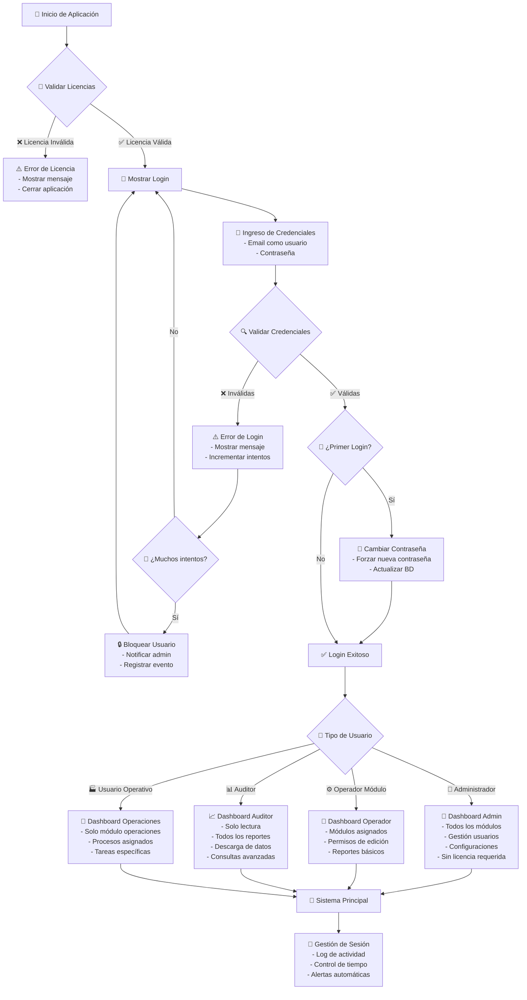
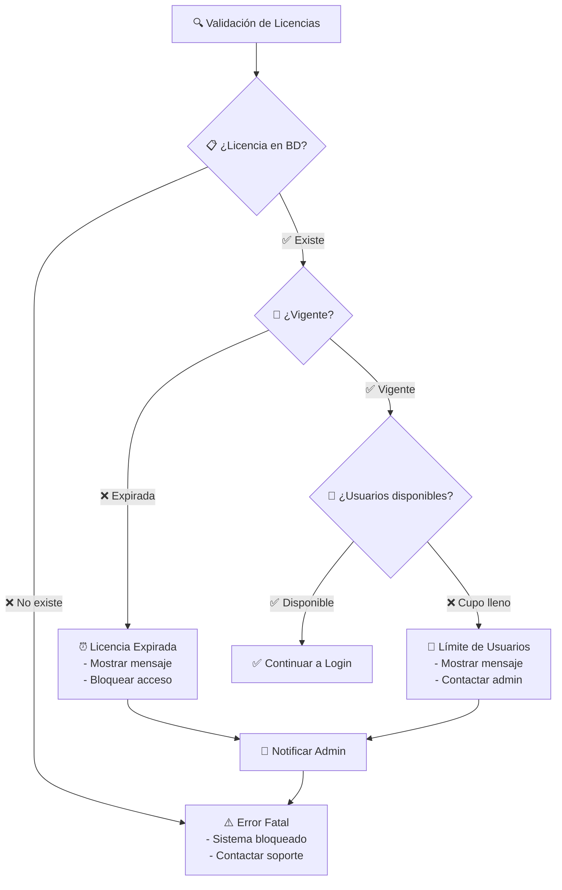
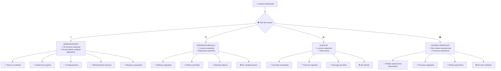
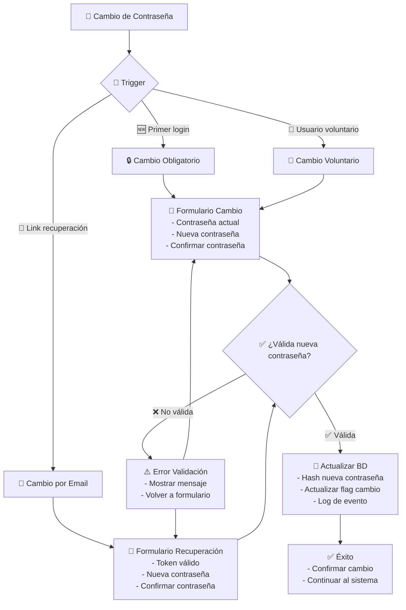
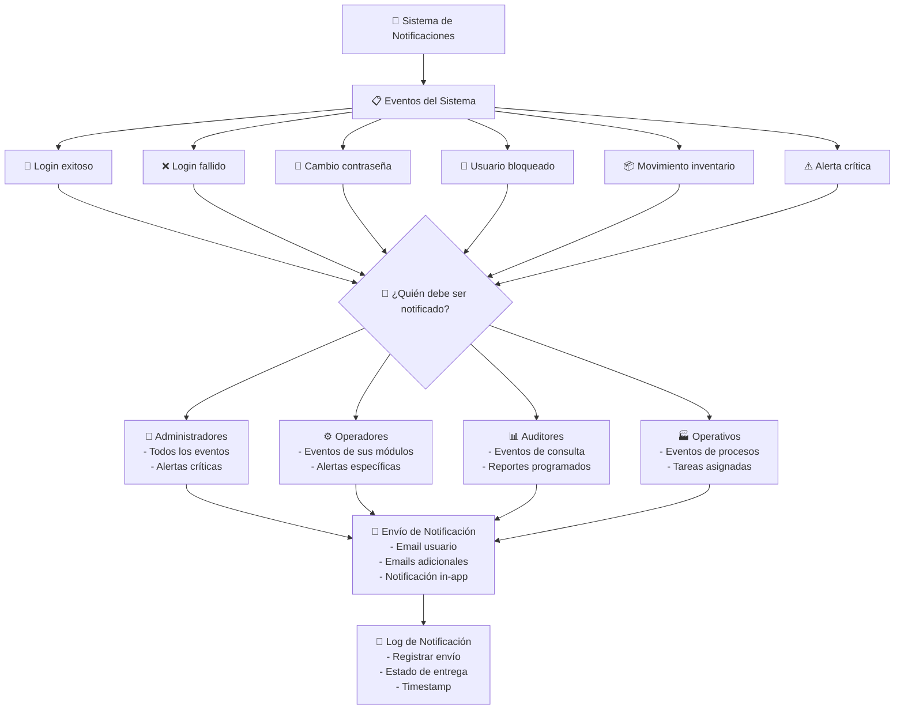

# Diagrama de Flujo - Inicio de Sesión SIGA

## 📋 Flujo Principal de Autenticación

## 🔐 Flujo de Validación de Licencias

## 👤 Flujo de Tipos de Usuario

## 🔄 Flujo de Cambio de Contraseña

## 📧 Flujo de Notificaciones

## 🔍 Estados y Validaciones

### 📊 Estados de Usuario
- ✅ **Activo**: Usuario operativo normal
- ⏸️ **Inactivo**: Usuario deshabilitado temporalmente
- 🔒 **Bloqueado**: Usuario bloqueado por intentos fallidos
- 🔑 **Primer Login**: Debe cambiar contraseña
- 📅 **Expirado**: Usuario con acceso vencido

### 🛡️ Validaciones de Seguridad
- 🔐 **Contraseña**: Mínimo 8 caracteres, mayúsculas, números
- 🚫 **Intentos**: Máximo 3 intentos fallidos
- ⏰ **Sesión**: Timeout configurable por tipo de usuario
- 📱 **Dispositivo**: Control por licencia (excepto admin)

### 📋 Tipos de Licencia
- 🏢 **Enterprise**: Usuarios ilimitados, todos los módulos
- 💼 **Professional**: Hasta 50 usuarios, módulos específicos
- 🏪 **Basic**: Hasta 10 usuarios, funciones básicas
